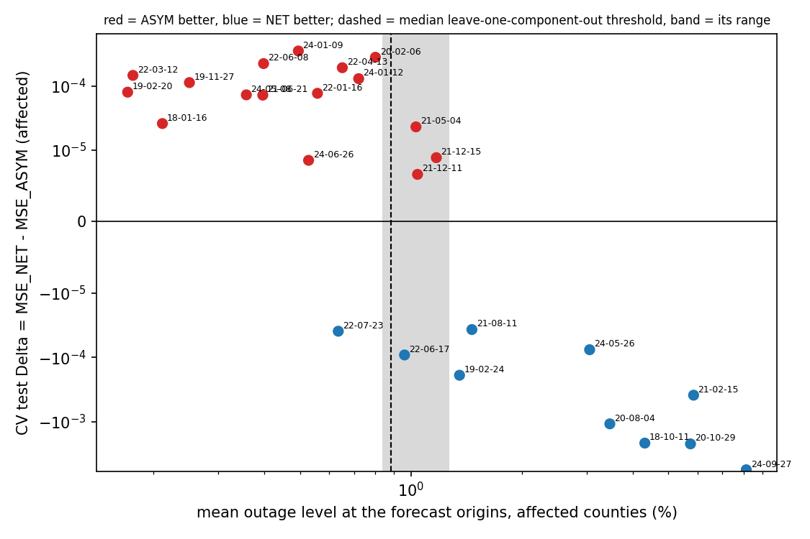
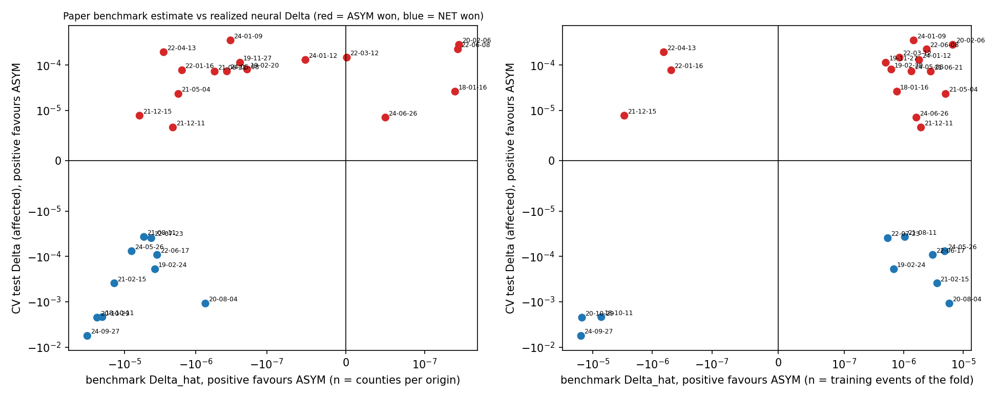
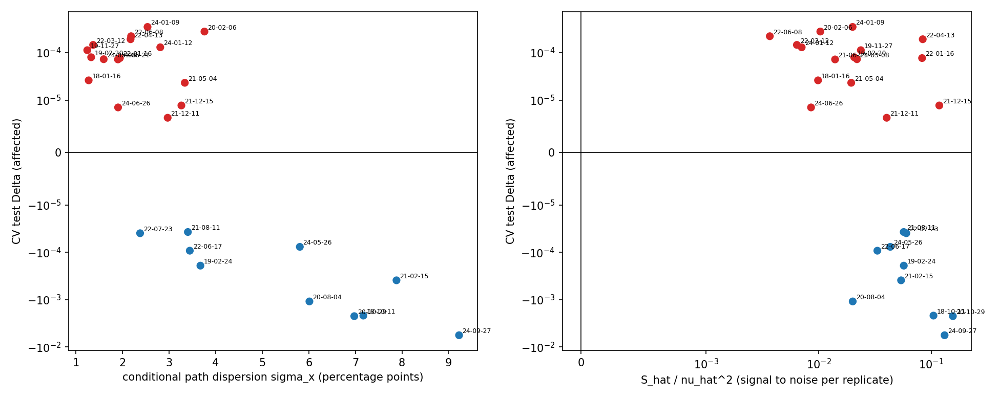

# 用数据特征判决 NET 还是 ASYM（事件级，按论文判据）

- **分支：** `research/net-asym-affected-cv-20260914`。
- **方向：** Δ = MSE_NET − MSE_ASYM，正数表示 ASYM 更好。模型结果取自本轮 5 折分组交叉验证的测试集（受灾县、5 个 seed 均值）。
- **性质：** 事后描述性分析，在看到 CV 结果之后设计。PI 于 2026-09-15 决定：以事件为单位；论文基准估计和可读特征都报告。
- **代码：** `code/event_features.py`（特征）、`code/event_features_decision.py`（判决检验）。

## 论文的判据

- **定理 1：** 两模型的路径风险差为 Δ = (ν² − nS)/(nH)。等价地，比较 Λ = nS/ν² 与 1。
- **三个量：**
  - S：双流结构排除、净流能多学到的条件均值信号。
  - ν²：学习这个信号时，同一方向上的条件路径噪声。
  - n：独立事件数。
- **规则：** Λ > 1 选 NET，Λ < 1 选 ASYM。
- **合成实验的可读主轴：** 条件路径离散度 σ_x（均值固定时越大越偏 ASYM）和独立事件数 n（越大越偏 NET）。

## 事件级怎么估计

- **近似重复：** 每个事件、每个预测起点，把同一起点的受灾县当作该条件下的近似重复（同一场风暴、同一时刻）。
- **基准拟合：** 用论文的可解基准拟合跨县均值路径：双流 (u, r)，净流 (u, r, b)。外部强迫取该时刻处于破坏性天气（阵风、降水或降雪超过阈值）的县的比例。
- **S 与 ν²：** 在净流多出的方向 q 上估计 S 和 ν²，并按附录 F 在县之间交叉拟合。σ_x 是扣除各县起点差异后的条件路径标准差。
- **汇总到事件：** Δ̂、Λ̂、信噪比 S/ν²、σ_x、每个起点的县数 n，以及各起点的平均停电水平。
- **模型结果的用法：** 所有特征只用数据计算，不用任何模型预测；模型结果只在最后用来检验判决。
- **阈值校准：** 按重叠分量留一，阈值只用其他事件确定，再用来判决被留出的事件。

## 结论

- **排序上，论文判据是对的。** 基准估计 Δ̂ 与神经模型实际 Δ 的秩相关为 +0.78；信噪比 S/ν² 越高越偏 NET（−0.60）。
- **判决阈值取决于有效独立事件数 n，而 n 在这批数据里识别不出来。** 直接按 Λ = 1 判决：
  - n 取每个起点的县数时，81% 的事件选 NET，风险比一律用 NET 低 1.3%。
  - n 取训练事件数时，只有 23% 选 NET，风险比一律用 NET 高 0.7%。
  - 用其他事件校准阈值后，隐含的 n_eff 约为 50（各折 35–51），规则风险仍比一律用 NET 高 0.3%。
- **起主导作用的数据特征是条件均值路径的停电水平。**
  - 在论文的状态反馈结构里，净流多出的响应方向随 g² 增长，所以信号 S 主要由停电水平决定。
  - 判决规则：起点平均停电水平高于约 0.88%（各折 0.84%–1.26%） 用 NET，否则用 ASYM（阈值留一分量校准）。
  - 效果：事件等权 MSE 比一律用 NET 低 3.2%，收回了事后逐事件选最优所能得到收益的 91%。判错的事件大多是两个模型几乎打平的事件。
  - 分布：起点平均停电水平高于约 1.3% 的事件都是 NET 更好，低于约 0.8% 的事件几乎都是 ASYM 更好；0.9%–1.2% 是过渡区，这里两模型的差距也很小。
- **离散度 σ_x 不能单独使用。**
  - 跨事件看，σ_x 越大越偏 NET（−0.68），和合成实验的主轴相反，因为大事件的信号和离散度同时变大。
  - 固定停电水平后，σ_x 越大越偏 ASYM（偏秩相关 +0.26），与论文预测的方向一致。
  - 每个起点的县数 n 几乎没有区分力。
- **停电水平之外，论文的信噪比只剩少量增量信息。** 固定停电水平后，Δ̂ 的偏秩相关为 +0.44，S/ν² 为 −0.24。反过来，固定信噪比后停电水平仍有 −0.63。26 个事件不足以把这部分增量单独变成更好的判决规则。

## 1. 判决效果

| 判决规则 | 事件等权 MSE（受灾） | 相对一律用 NET | 收回的可选收益 | 选中实际更优者 | 选 NET 的事件 |
|---|---:|---:|---:|---:|---:|
| 一律用 NET | 1.9689e-03 | +0.0% | 0% | — | 100% |
| 一律用 ASYM | 2.3581e-03 | +19.8% | -558% | — | 0% |
| 每个事件事后选更优者（上限） | 1.8991e-03 | -3.5% | 100% | 100% | 38% |
| 论文判据 Λ̂ = 1，n 取每个起点的县数（未校准） | 1.9425e-03 | -1.3% | 38% | 58% | 81% |
| 论文判据 Λ̂ = 1，n 取训练折的事件数（未校准） | 1.9833e-03 | +0.7% | -21% | 62% | 23% |
| 论文信噪比 S/ν²，阈值 1/n_eff（留一分量校准） | 1.9756e-03 | +0.3% | -10% | 65% | 65% |
| 条件路径离散度 σ_x（留一分量校准） | 1.9417e-03 | -1.4% | 39% | 73% | 42% |
| 起点平均停电水平（留一分量校准） | 1.9057e-03 | -3.2% | 91% | 81% | 42% |
| 每个起点的县数 n（留一分量校准） | 2.2259e-03 | +13.1% | -369% | 38% | 85% |

"收回的可选收益"是规则相对一律用 NET 降低的风险，占"事后逐事件选最优"所能降低风险的比例；负数表示比一律用 NET 更差。

## 2. 特征与实际胜负

| 特征 | 与 Δ 的秩相关 | 与相对 Δ 的秩相关 | 固定停电水平后的偏秩相关 |
|---|---:|---:|---:|
| 论文基准 Δ̂（n = 县数；正数偏 ASYM） | +0.78 | +0.74 | +0.44 |
| 论文 Λ̂（n = 县数） | -0.57 | -0.49 | — |
| 信噪比 S/ν² | -0.60 | -0.55 | -0.24 |
| 信号 Ŝ | -0.77 | -0.79 | -0.31 |
| 噪声 ν̂² | -0.73 | -0.81 | -0.13 |
| 条件路径离散度 σ_x | -0.68 | -0.79 | +0.26 |
| 起点平均停电水平 | -0.77 | -0.84 | — |
| 每个起点的县数 n | -0.27 | -0.18 | — |

- 秩相关以 Δ 的方向为准：正数表示特征越大越偏 ASYM，负数表示越偏 NET。
- "相对 Δ" 是 Δ 除以该事件 NET 的 MSE，用来排除事件规模的影响。

## 3. 逐事件（按起点平均停电水平排序）

| 事件 | 起点平均停电水平 % | σ_x（百分点） | S/ν² | Λ̂（n = 县数） | Δ̂（n = 县数） | CV 测试 Δ | Δ>0 的 seed | 实际更优 | 判决：停电水平 | 判决：信噪比 |
|---|---:|---:|---:|---:|---:|---:|---:|---:|---:|---:|
| 2019-02-20 | 0.17 | 1.33 | 0.021 | 3.29 | -1.89e-07 | +8.02e-05 | 5/5 | ASYM | ASYM | NET |
| 2022-03-12 | 0.18 | 1.37 | 0.006 | 0.97 | +1.47e-09 | +1.46e-04 | 5/5 | ASYM | ASYM | ASYM |
| 2018-01-16 | 0.21 | 1.27 | 0.010 | 0.17 | +2.69e-07 | +2.61e-05 | 3/5 | ASYM | ASYM | ASYM |
| 2019-11-27 | 0.25 | 1.24 | 0.024 | 3.44 | -2.38e-07 | +1.13e-04 | 5/5 | ASYM | ASYM | NET |
| 2024-05-08 | 0.36 | 1.60 | 0.022 | 2.58 | -3.64e-07 | +7.29e-05 | 3/5 | ASYM | ASYM | NET |
| 2021-06-21 | 0.40 | 1.90 | 0.014 | 2.57 | -5.41e-07 | +7.22e-05 | 5/5 | ASYM | ASYM | ASYM |
| 2022-06-08 | 0.40 | 2.18 | 0.004 | 0.38 | +2.94e-07 | +2.23e-04 | 5/5 | ASYM | ASYM | ASYM |
| 2024-01-09 | 0.49 | 2.54 | 0.020 | 2.06 | -3.24e-07 | +3.51e-04 | 5/5 | ASYM | ASYM | NET |
| 2024-06-26 | 0.53 | 1.90 | 0.009 | 0.85 | +5.03e-08 | +8.59e-06 | 3/5 | ASYM | ASYM | ASYM |
| 2022-01-16 | 0.56 | 1.94 | 0.083 | 15.80 | -1.56e-06 | +7.70e-05 | 5/5 | ASYM | ASYM | NET |
| 2022-07-23 | 0.63 | 2.38 | 0.060 | 7.82 | -4.22e-06 | -3.93e-05 | 2/5 | NET | ASYM | NET |
| 2022-04-13 | 0.65 | 2.17 | 0.084 | 10.86 | -2.83e-06 | +1.93e-04 | 5/5 | ASYM | ASYM | NET |
| 2024-01-12 | 0.72 | 2.81 | 0.007 | 1.33 | -5.10e-08 | +1.30e-04 | 4/5 | ASYM | ASYM | ASYM |
| 2020-02-06 | 0.80 | 3.76 | 0.010 | 0.81 | +3.05e-07 | +2.80e-04 | 5/5 | ASYM | ASYM | ASYM |
| 2022-06-17 | 0.96 | 3.44 | 0.033 | 8.18 | -3.50e-06 | -9.20e-05 | 1/5 | NET | ASYM | NET |
| 2021-05-04 | 1.03 | 3.34 | 0.019 | 3.41 | -1.75e-06 | +2.31e-05 | 3/5 | ASYM | NET | ASYM |
| 2021-12-11 | 1.04 | 2.97 | 0.040 | 6.19 | -2.10e-06 | +6.62e-06 | 2/5 | ASYM | NET | NET |
| 2021-12-15 | 1.17 | 3.26 | 0.118 | 5.55 | -6.18e-06 | +8.97e-06 | 3/5 | ASYM | NET | NET |
| 2019-02-24 | 1.35 | 3.67 | 0.057 | 15.54 | -3.74e-06 | -1.90e-04 | 0/5 | NET | NET | NET |
| 2021-08-11 | 1.46 | 3.40 | 0.057 | 8.71 | -5.35e-06 | -3.70e-05 | 3/5 | NET | NET | NET |
| 2024-05-26 | 3.06 | 5.81 | 0.043 | 8.94 | -7.98e-06 | -7.62e-05 | 2/5 | NET | NET | NET |
| 2020-08-04 | 3.47 | 6.01 | 0.020 | 1.32 | -7.31e-07 | -1.09e-03 | 0/5 | NET | NET | ASYM |
| 2018-10-11 | 4.32 | 7.17 | 0.105 | 10.70 | -2.07e-05 | -2.17e-03 | 0/5 | NET | NET | NET |
| 2020-10-29 | 5.74 | 6.98 | 0.155 | 12.69 | -2.44e-05 | -2.23e-03 | 0/5 | NET | NET | NET |
| 2021-02-15 | 5.86 | 7.88 | 0.054 | 10.60 | -1.40e-05 | -3.89e-04 | 2/5 | NET | NET | NET |
| 2024-09-27 | 8.14 | 9.23 | 0.131 | 31.91 | -3.36e-05 | -5.63e-03 | 0/5 | NET | NET | NET |

## 限制

- **事后分析：** 特征和判决规则是在看过 CV 结果之后设计的。留一分量校准只能保证阈值不用到被判决的事件本身，不能代替在新事件上的验证。
- **样本小：** 只有 26 个事件、23 个重叠分量；相关系数都是描述性的。
- **不满足论文假设：** 同一事件的县共享冲击，天气也不完全相同，不满足论文"独立、同输入重复"的假设。有 约 26% 的起点，偏差校正后的 Ŝ 为负。
- **基准的适用范围：** 可解基准是低维的 (u, r) 对 (u, r, b)；论文也指出，它的响应方向不能直接套用到神经网络上。
- **阈值的迁移：** 起点平均停电水平是预测时就能拿到的输入，但约 0.9% 这个阈值来自本数据，换数据需要重新校准。
