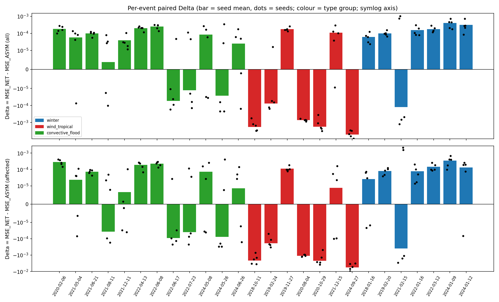
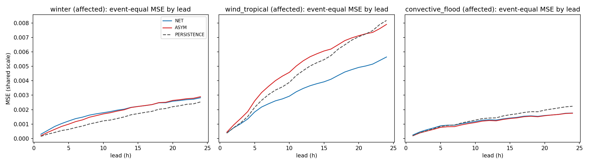
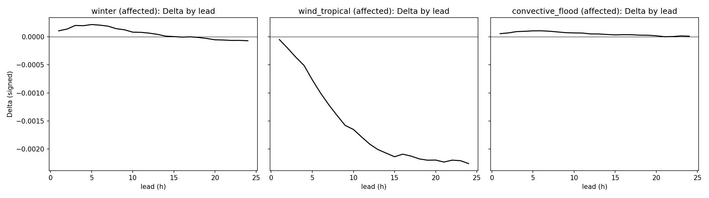

# NET / ASYM 受灾县分组交叉验证轮：结果

- **分支：** `research/net-asym-affected-cv-20260914`。
- **方向：** Δ = MSE_NET − MSE_ASYM，正数支持 ASYM。
- **依据：** 设计与判定规则见 `PROTOCOL_ZH.md`，在任何训练之前提交；PI 的决定和运行中的记录见 `logs/PI_DECISIONS_AND_NOTES.md`。

| commit | 内容 |
|---|---|
| `d7bf5bf` | 协议、配置、折锁、代码、测试、profile 和预注册分析脚本（任何 DEV 之前） |
| `03dd349` | 180 次 DEV 日志与选参锁（任何 final 或测试评分之前） |
| `6adf6ee` | 50 次 final、预测分片、checkpoint、重放记录和分析脚本输出 |
| 本提交 | 结果说明、README 和校验值 |

## 结论一览

**判定规则：** 以重叠分量为单位做符号翻转检验。只有 p < 0.05，且事件等权 Δ 与分量均值 Δ 同号时才判定，否则记为未决。

| 分组（事件数） | 受灾人群 | 全部人群 | 未受灾人群 |
|---|---|---|---|
| 全部 26 个事件 | 未决（Δ -3.89e-04，p = 0.113） | 未决（Δ -2.77e-04，p = 0.206） | 支持 ASYM（Δ +2.62e-04，p < 5e-06） |
| 冬季组（7） | 未决（Δ +6.03e-05，p = 0.750） | 未决（Δ +1.55e-04，p = 0.125） | 支持 ASYM（Δ +3.03e-04，p = 0.031） |
| 大风/热带组（7） | 未决（Δ -1.60e-03，p = 0.062） | 未决（Δ -1.31e-03，p = 0.109） | 支持 ASYM（Δ +4.23e-04，p = 0.016） |
| 对流/洪水组（12） | 未决（Δ +5.30e-05，p = 0.168） | 支持 ASYM（Δ +7.09e-05，p = 0.024） | 支持 ASYM（Δ +1.45e-04，p = 4.9e-04） |

**总体（受灾人群）：未决，方向偏 NET。**
- Δ = −3.89e-04，p = 0.11。26 个事件中 16 个 ASYM 更好，但 5 个 seed 的事件等权 Δ 全部为负，由少数大事件决定。
- 两个相对口径方向相反：mean-event-relative gain 为 +1.5%，偏 ASYM；ratio-of-event-means gain 为 −19.8%，偏 NET。

**按类型明显分化。**
- **对流/洪水组：** 全部人群判定支持 ASYM（p = 0.024）。只看受灾人群为未决（p = 0.17），但 5 个 seed 仍全部偏 ASYM。
- **冬季组：** 7 个事件中 6 个 ASYM 更好，但 2021-02-15 反向，未决。
- **大风/热带组：** 方向一致偏 NET，但未通过判定。受灾人群里 7 个事件中 5 个 NET 更好，5 个 seed 全部偏 NET，p = 0.0625；3 个热带事件全部 NET 更好。

**和持久性相比（受灾人群，逐事件）：**
- ASYM 在 21/26 个事件上好于持久性，NET 为 15/26。
- ASYM 在三个最大的大风/热带事件（2018-10-11、2020-10-29、2024-09-27）上不如持久性；NET 在 7 个冬季事件上全部不如持久性。
- 事件等权合计：NET 比持久性低 12.8%，ASYM 比持久性高 4.4%。

**未受灾县：判定支持 ASYM，但两个模型都远不如持久性。**
- 只用受灾县训练后，两个模型都会在没有停电的县预测出虚假停电。NET 的 MSE 约为持久性的 320 倍，ASYM 约为 75 倍。
- ASYM 的源池结构把这类误差压得更低。判定为"支持 ASYM"是因为这一点，不代表 ASYM 学到了更好的响应。

**其他：**
- **起点差异没有决定结果。** 未训练时 ASYM 略好（受灾人群事件等权 +7.1e-05），这个差距小于多数事件训练后的差距；在大风/热带事件上，训练把方向反转成了 NET 更好。
- **RMSE（次要指标）：** 在所有分组和人群里方向都与 MSE 一致。
- **损坏:恢复比例：** 5 折中 4 折选中了损坏更多的结构（2:1 一次、3:1 三次）。

## 1. 实际运行了什么

- **设计（PI 2026-09-14 决定）：**
  - 训练和内层验证只用受灾县-事件（事件峰值 ≥ 1%）。
  - 26 个事件做 5 折分组交叉验证：按类型分层，时间重叠的事件放在同一折，不同折之间不共享任何（县, 小时）单元。
  - ASYM 拆成独立的损坏网络和恢复网络，比例在 1:1、2:1、3:1 中选；NET 在 2、3、4 层中选。所有候选总参数都在 32,768 ± 1%。
  - 两模型使用相同的学习率网格、最大更新数和早停规则，都从接近持久性的状态起步。
- **DEV：** 5 折 × 2 模型 × 9 配置 × 2 seed，共 180 次（单次墙钟合计 5.9 h，3 个 worker 并行约 2.1 h）。选参锁在 final 之前提交并推送。
- **final：** 每折每模型 5 个 seed，共 50 次，逐 seed 在内层验证上早停（单次墙钟合计约 1.8 h，并行约 37 分钟）。每个外层折的全部合法测试窗口都参与评分，每个事件只由没见过它的模型评价。
- **核查：**
  - 50 个 checkpoint 纯重放，与保存的预测逐位一致。
  - 同一折、同一 seed 下，两模型的 batch 样本 ID 相同。
  - 参数量全部在 1% 以内。
  - 未训练模型的重建结果与日志逐位一致。
- **重建说明：** 第一次运行的工作副本在 DEV 之后、选参之前因机器重启丢失（从未推送，没有选参锁或测试结果）。本轮按原样重建并重跑，重跑结果与丢失前看到的第 0 折 DEV 中间结果一致。

## 2. 预注册判定（主指标 MSE）

| 分组 | 人群 | 事件 | 分量 | Δ（事件等权） | 分量重采样 95% 区间 | Δ>0 分量 | Δ>0 事件 | Δ>0 seed | 符号翻转 p | 最小可达 p | 判定 | mean-event-relative gain | ratio-of-event-means gain | Δ RMSE（次要） | RMSE p（次要） | RMSE 同向 |
|---|---|---:|---:|---:|---:|---:|---:|---:|---:|---:|---:|---:|---:|---:|---:|---:|
| 全部 26 个事件 | 全部 | 26 | 23 | -2.77e-04 | [-7.61e-04, +6.10e-05] | 15/23 | 17/26 | 0/5 | 0.2063（MC） | — | 未决 | +11.5% | -18.4% | -6.55e-05 | 0.7922 | 是 |
| 冬季组 | 全部 | 7 | 6 | +1.55e-04 | [+9.11e-06, +2.78e-04] | 5/6 | 6/7 | 3/5 | 0.1250 | 0.0312 | 未决 | +39.9% | +14.7% | +4.28e-03 | 0.0625 | 是 |
| 大风/热带组 | 全部 | 7 | 7 | -1.31e-03 | [-2.67e-03, -2.48e-04] | 2/7 | 2/7 | 0/5 | 0.1094 | 0.0156 | 未决 | -17.7% | -44.9% | -7.20e-03 | 0.1562 | 是 |
| 对流/洪水组 | 全部 | 12 | 12 | +7.09e-05 | [+2.07e-05, +1.25e-04] | 9/12 | 9/12 | 5/5 | 0.0244 | 0.0005 | 支持 ASYM | +11.9% | +7.5% | +1.56e-03 | 0.0142 | 是 |
| 对流 | 全部 | 11 | 11 | +6.07e-05 | [+1.18e-05, +1.18e-04] | 8/11 | 8/11 | 5/5 | 0.0488 | 0.0010 | 支持 ASYM | +11.4% | +6.5% | +1.44e-03 | 0.0283 | 是 |
| 洪水 | 全部 | 1 | 1 | +1.83e-04 | [+1.83e-04, +1.83e-04] | 1/1 | 1/1 | 5/5 | 1.0000 | 1.0000 | 未决 | +17.2% | +17.2% | +2.93e-03 | 1.0000 | 是 |
| 热带 | 全部 | 3 | 3 | -1.43e-03 | [-1.81e-03, -7.24e-04] | 0/3 | 0/3 | 0/5 | 0.2500 | 0.2500 | 未决 | -39.0% | -39.9% | -1.06e-02 | 0.2500 | 是 |
| 大风 | 全部 | 4 | 4 | -1.21e-03 | [-3.76e-03, +1.43e-04] | 2/4 | 2/4 | 0/5 | 0.8750 | 0.1250 | 未决 | -1.7% | -50.5% | -4.64e-03 | 0.8750 | 是 |
| 冬季 | 全部 | 7 | 6 | +1.55e-04 | [+6.01e-06, +2.78e-04] | 5/6 | 6/7 | 3/5 | 0.1250 | 0.0312 | 未决 | +39.9% | +14.7% | +4.28e-03 | 0.0625 | 是 |
| 全部 26 个事件 | 受灾 | 26 | 23 | -3.89e-04 | [-9.64e-04, +1.77e-06] | 13/23 | 16/26 | 0/5 | 0.1125（MC） | — | 未决 | +1.5% | -19.8% | -1.38e-03 | 0.3059 | 是 |
| 冬季组 | 受灾 | 7 | 6 | +6.03e-05 | [-1.44e-04, +1.85e-04] | 5/6 | 6/7 | 2/5 | 0.7500 | 0.0312 | 未决 | +18.5% | +3.2% | +2.17e-03 | 0.0938 | 是 |
| 大风/热带组 | 受灾 | 7 | 7 | -1.60e-03 | [-3.06e-03, -3.59e-04] | 2/7 | 2/7 | 0/5 | 0.0625 | 0.0156 | 未决 | -24.9% | -47.7% | -9.05e-03 | 0.0938 | 是 |
| 对流/洪水组 | 受灾 | 12 | 12 | +5.30e-05 | [-8.30e-06, +1.22e-04] | 8/12 | 8/12 | 5/5 | 0.1685 | 0.0005 | 未决 | +6.9% | +4.4% | +1.02e-03 | 0.0908 | 是 |
| 对流 | 受灾 | 11 | 11 | +3.23e-05 | [-2.24e-05, +9.36e-05] | 7/11 | 7/11 | 4/5 | 0.3369 | 0.0010 | 未决 | +6.2% | +2.8% | +8.01e-04 | 0.1816 | 是 |
| 洪水 | 受灾 | 1 | 1 | +2.80e-04 | [+2.80e-04, +2.80e-04] | 1/1 | 1/1 | 5/5 | 1.0000 | 1.0000 | 未决 | +15.3% | +15.3% | +3.39e-03 | 1.0000 | 是 |
| 热带 | 受灾 | 3 | 3 | -1.83e-03 | [-2.23e-03, -1.09e-03] | 0/3 | 0/3 | 0/5 | 0.2500 | 0.2500 | 未决 | -43.3% | -44.2% | -1.26e-02 | 0.2500 | 是 |
| 大风 | 受灾 | 4 | 4 | -1.43e-03 | [-4.22e-03, +6.10e-05] | 2/4 | 2/4 | 0/5 | 0.5000 | 0.1250 | 未决 | -11.2% | -51.7% | -6.42e-03 | 0.7500 | 是 |
| 冬季 | 受灾 | 7 | 6 | +6.03e-05 | [-1.50e-04, +1.81e-04] | 5/6 | 6/7 | 2/5 | 0.7500 | 0.0312 | 未决 | +18.5% | +3.2% | +2.17e-03 | 0.0938 | 是 |
| 全部 26 个事件 | 未受灾 | 26 | 23 | +2.62e-04 | [+1.60e-04, +3.86e-04] | 23/23 | 26/26 | 5/5 | 0.0000（MC） | — | 支持 ASYM | +81.8% | +76.7% | +1.08e-02 | 0.0000 | 是 |
| 冬季组 | 未受灾 | 7 | 6 | +3.03e-04 | [+1.09e-04, +5.24e-04] | 6/6 | 7/7 | 5/5 | 0.0312 | 0.0312 | 支持 ASYM | +96.4% | +95.0% | +1.34e-02 | 0.0312 | 是 |
| 大风/热带组 | 未受灾 | 7 | 7 | +4.23e-04 | [+2.20e-04, +7.48e-04] | 7/7 | 7/7 | 5/5 | 0.0156 | 0.0156 | 支持 ASYM | +81.1% | +68.8% | +1.39e-02 | 0.0156 | 是 |
| 对流/洪水组 | 未受灾 | 12 | 12 | +1.45e-04 | [+1.10e-04, +1.82e-04] | 12/12 | 12/12 | 5/5 | 0.0005 | 0.0005 | 支持 ASYM | +73.7% | +73.8% | +7.46e-03 | 0.0005 | 是 |
| 对流 | 未受灾 | 11 | 11 | +1.53e-04 | [+1.17e-04, +1.92e-04] | 11/11 | 11/11 | 5/5 | 0.0010 | 0.0010 | 支持 ASYM | +74.3% | +74.1% | +7.76e-03 | 0.0010 | 是 |
| 洪水 | 未受灾 | 1 | 1 | +6.16e-05 | [+6.16e-05, +6.16e-05] | 1/1 | 1/1 | 5/5 | 1.0000 | 1.0000 | 未决 | +66.3% | +66.3% | +4.12e-03 | 1.0000 | 是 |
| 热带 | 未受灾 | 3 | 3 | +6.73e-04 | [+2.62e-04, +1.34e-03] | 3/3 | 3/3 | 5/5 | 0.2500 | 0.2500 | 未决 | +87.4% | +89.3% | +1.75e-02 | 0.2500 | 是 |
| 大风 | 未受灾 | 4 | 4 | +2.36e-04 | [+1.60e-04, +3.14e-04] | 4/4 | 4/4 | 4/5 | 0.1250 | 0.1250 | 未决 | +76.4% | +46.2% | +1.11e-02 | 0.1250 | 是 |
| 冬季 | 未受灾 | 7 | 6 | +3.03e-04 | [+1.08e-04, +5.26e-04] | 6/6 | 7/7 | 5/5 | 0.0312 | 0.0312 | 支持 ASYM | +96.4% | +95.0% | +1.34e-02 | 0.0312 | 是 |

- **p 的计算：** 分量 ≤ 16 个时精确枚举；全部 26 个事件有 23 个分量，改用 20 万次蒙特卡洛，表中标"MC"，结果为 0 的记作 p < 5e-06。
- **最小可达 p：** 类型分组的分量很少（热带 3、大风 4、洪水 1），最小可达 p 本身就可能 ≥ 0.05，这类分组只能判为未决。
- **次要指标：** RMSE 两列不参与判定。

## 3. 误差水平与端点（事件等权）

| 分组 | 人群 | NET path MSE | ASYM path MSE | PERSISTENCE path MSE | Δ 1h | Δ 6h | Δ 24h | NET RMSE | ASYM RMSE | PERSISTENCE RMSE |
|---|---|---:|---:|---:|---:|---:|---:|---:|---:|---:|
| 全部 26 个事件 | 全部 | 1.506e-03 | 1.783e-03 | 1.710e-03 | +3.69e-05 | -1.40e-04 | -4.03e-04 | 3.399e-02 | 3.406e-02 | 3.469e-02 |
| 冬季组 | 全部 | 1.058e-03 | 9.026e-04 | 7.234e-04 | +8.04e-05 | +1.44e-04 | +2.13e-04 | 2.699e-02 | 2.271e-02 | 2.179e-02 |
| 大风/热带组 | 全部 | 2.909e-03 | 4.216e-03 | 3.871e-03 | -3.18e-05 | -8.17e-04 | -1.84e-03 | 4.951e-02 | 5.671e-02 | 5.583e-02 |
| 对流/洪水组 | 全部 | 9.490e-04 | 8.781e-04 | 1.024e-03 | +5.17e-05 | +8.83e-05 | +7.58e-05 | 2.902e-02 | 2.746e-02 | 2.987e-02 |
| 对流 | 全部 | 9.386e-04 | 8.780e-04 | 1.030e-03 | +4.29e-05 | +5.32e-05 | +1.12e-04 | 2.869e-02 | 2.726e-02 | 2.977e-02 |
| 洪水 | 全部 | 1.063e-03 | 8.798e-04 | 9.586e-04 | +1.48e-04 | +4.75e-04 | -3.23e-04 | 3.258e-02 | 2.966e-02 | 3.096e-02 |
| 热带 | 全部 | 3.592e-03 | 5.026e-03 | 4.828e-03 | -4.62e-05 | -1.19e-03 | -1.66e-03 | 5.982e-02 | 7.043e-02 | 6.933e-02 |
| 大风 | 全部 | 2.398e-03 | 3.608e-03 | 3.153e-03 | -2.11e-05 | -5.34e-04 | -1.98e-03 | 4.178e-02 | 4.643e-02 | 4.571e-02 |
| 冬季 | 全部 | 1.058e-03 | 9.026e-04 | 7.234e-04 | +8.04e-05 | +1.44e-04 | +2.13e-04 | 2.699e-02 | 2.271e-02 | 2.179e-02 |
| 全部 26 个事件 | 受灾 | 1.969e-03 | 2.358e-03 | 2.258e-03 | +4.09e-05 | -1.65e-04 | -6.22e-04 | 3.867e-02 | 4.006e-02 | 4.105e-02 |
| 冬季组 | 受灾 | 1.882e-03 | 1.822e-03 | 1.421e-03 | +1.06e-04 | +2.07e-04 | -7.07e-05 | 3.386e-02 | 3.169e-02 | 3.039e-02 |
| 大风/热带组 | 受灾 | 3.345e-03 | 4.942e-03 | 4.594e-03 | -4.97e-05 | -1.00e-03 | -2.26e-03 | 5.347e-02 | 6.252e-02 | 6.191e-02 |
| 对流/洪水组 | 受灾 | 1.217e-03 | 1.164e-03 | 1.384e-03 | +5.56e-05 | +1.06e-04 | +1.01e-05 | 3.285e-02 | 3.184e-02 | 3.509e-02 |
| 对流 | 受灾 | 1.160e-03 | 1.128e-03 | 1.353e-03 | +4.52e-05 | +4.44e-05 | +6.48e-05 | 3.194e-02 | 3.114e-02 | 3.451e-02 |
| 洪水 | 受灾 | 1.837e-03 | 1.557e-03 | 1.723e-03 | +1.70e-04 | +7.89e-04 | -5.92e-04 | 4.284e-02 | 3.945e-02 | 4.151e-02 |
| 热带 | 受灾 | 4.127e-03 | 5.953e-03 | 5.714e-03 | -5.80e-05 | -1.48e-03 | -2.18e-03 | 6.408e-02 | 7.664e-02 | 7.547e-02 |
| 大风 | 受灾 | 2.759e-03 | 4.184e-03 | 3.754e-03 | -4.34e-05 | -6.42e-04 | -2.32e-03 | 4.550e-02 | 5.192e-02 | 5.174e-02 |
| 冬季 | 受灾 | 1.882e-03 | 1.822e-03 | 1.421e-03 | +1.06e-04 | +2.07e-04 | -7.07e-05 | 3.386e-02 | 3.169e-02 | 3.039e-02 |
| 全部 26 个事件 | 未受灾 | 3.420e-04 | 7.959e-05 | 1.056e-06 | +4.66e-05 | +1.17e-04 | +4.82e-04 | 1.662e-02 | 5.829e-03 | 1.001e-03 |
| 冬季组 | 未受灾 | 3.188e-04 | 1.580e-05 | 7.218e-07 | +6.06e-05 | +1.18e-04 | +5.85e-04 | 1.584e-02 | 2.418e-03 | 8.012e-04 |
| 大风/热带组 | 未受灾 | 6.145e-04 | 1.915e-04 | 1.329e-06 | +4.09e-05 | +1.88e-04 | +7.71e-04 | 2.264e-02 | 8.788e-03 | 1.137e-03 |
| 对流/洪水组 | 未受灾 | 1.965e-04 | 5.153e-05 | 1.093e-06 | +4.17e-05 | +7.62e-05 | +2.53e-04 | 1.355e-02 | 6.092e-03 | 1.038e-03 |
| 对流 | 未受灾 | 2.059e-04 | 5.336e-05 | 1.128e-06 | +3.46e-05 | +7.59e-05 | +2.75e-04 | 1.392e-02 | 6.158e-03 | 1.056e-03 |
| 洪水 | 未受灾 | 9.303e-05 | 3.139e-05 | 6.993e-07 | +1.20e-04 | +7.99e-05 | +1.40e-05 | 9.493e-03 | 5.369e-03 | 8.363e-04 |
| 热带 | 未受灾 | 7.529e-04 | 8.027e-05 | 1.557e-06 | +1.33e-05 | +3.36e-04 | +1.10e-03 | 2.549e-02 | 7.974e-03 | 1.228e-03 |
| 大风 | 未受灾 | 5.107e-04 | 2.749e-04 | 1.158e-06 | +6.17e-05 | +7.66e-05 | +5.20e-04 | 2.050e-02 | 9.398e-03 | 1.070e-03 |
| 冬季 | 未受灾 | 3.188e-04 | 1.580e-05 | 7.218e-07 | +6.06e-05 | +1.18e-04 | +5.85e-04 | 1.584e-02 | 2.418e-03 | 8.012e-04 |

受灾人群按时距的端点 Δ：

| 类型组 | 1 h | 6 h | 24 h |
|---|---:|---:|---:|
| 冬季组 | +1.06e-04 | +2.07e-04 | −7.07e-05 |
| 大风/热带组 | −4.97e-05 | −1.00e-03 | −2.26e-03 |
| 对流/洪水组 | +5.56e-05 | +1.06e-04 | +1.01e-05 |

冬季和对流在短时距 ASYM 更好；大风/热带从 1 h 起就偏 NET，而且时距越长差距越大。

## 4. 逐事件（受灾人群）

| 事件 | 类型 | 折 | 县 | NET | ASYM | PERSISTENCE | Δ | Δ>0 seed | 未训练 Δ | Δ RMSE | NET 符号误差 | ASYM 符号误差 | PERSISTENCE 符号误差 |
|---|---|---:|---:|---:|---:|---:|---:|---:|---:|---:|---:|---:|---:|
| 2020-02-06 | 洪水 | 1 | 89 | 1.837e-03 | 1.557e-03 | 1.723e-03 | +2.80e-04 | 5/5 | +5.23e-05 | +3.39e-03 | -1.38e-03 | -3.77e-04 | +2.19e-05 |
| 2021-05-04 | 对流 | 2 | 250 | 1.031e-03 | 1.008e-03 | 1.502e-03 | +2.31e-05 | 3/5 | +4.97e-05 | +3.67e-04 | -2.08e-04 | -1.93e-03 | +1.52e-03 |
| 2021-06-21 | 对流 | 3 | 190 | 5.065e-04 | 4.344e-04 | 6.282e-04 | +7.22e-05 | 5/5 | +1.68e-05 | +1.66e-03 | +4.24e-03 | -1.22e-03 | +1.38e-04 |
| 2021-08-11 | 对流 | 4 | 187 | 1.450e-03 | 1.487e-03 | 1.574e-03 | -3.70e-05 | 3/5 | +6.19e-05 | -4.90e-04 | -4.33e-03 | -1.69e-03 | +1.04e-03 |
| 2021-12-11 | 对流 | 0 | 178 | 8.871e-04 | 8.805e-04 | 1.126e-03 | +6.62e-06 | 2/5 | +3.37e-05 | +1.02e-04 | -5.69e-03 | -2.65e-03 | -1.14e-06 |
| 2022-04-13 | 对流 | 1 | 133 | 7.420e-04 | 5.493e-04 | 7.305e-04 | +1.93e-04 | 5/5 | +2.16e-05 | +3.77e-03 | +3.17e-03 | +1.33e-03 | -5.91e-05 |
| 2022-06-08 | 对流 | 2 | 109 | 9.546e-04 | 7.312e-04 | 9.712e-04 | +2.23e-04 | 5/5 | +2.89e-05 | +3.88e-03 | +5.38e-03 | +6.97e-04 | -1.04e-06 |
| 2022-06-17 | 对流 | 3 | 289 | 1.423e-03 | 1.515e-03 | 1.774e-03 | -9.20e-05 | 1/5 | +4.27e-05 | -1.20e-03 | -5.63e-04 | -6.00e-03 | -1.54e-03 |
| 2022-07-23 | 对流 | 4 | 136 | 6.567e-04 | 6.959e-04 | 8.794e-04 | -3.93e-05 | 2/5 | +2.77e-05 | -7.18e-04 | -1.54e-03 | +6.20e-04 | +8.73e-05 |
| 2024-05-08 | 对流 | 0 | 118 | 4.542e-04 | 3.812e-04 | 3.852e-04 | +7.29e-05 | 3/5 | +1.02e-05 | +1.74e-03 | +4.31e-03 | +1.92e-03 | -2.77e-05 |
| 2024-05-26 | 对流 | 1 | 207 | 4.190e-03 | 4.266e-03 | 4.733e-03 | -7.62e-05 | 2/5 | +1.45e-04 | -5.64e-04 | -9.77e-03 | -9.64e-03 | +4.46e-06 |
| 2024-06-26 | 对流 | 2 | 99 | 4.664e-04 | 4.579e-04 | 5.823e-04 | +8.59e-06 | 3/5 | +1.91e-05 | +2.69e-04 | +9.21e-04 | -2.74e-04 | +5.52e-04 |
| 2018-10-11 | 热带 | 0 | 108 | 4.600e-03 | 6.766e-03 | 6.638e-03 | -2.17e-03 | 0/5 | +2.00e-04 | -1.42e-02 | -1.80e-03 | -1.83e-03 | -1.24e-03 |
| 2019-02-24 | 大风 | 1 | 289 | 1.545e-03 | 1.735e-03 | 2.016e-03 | -1.90e-04 | 0/5 | +7.28e-05 | -2.36e-03 | -6.00e-03 | -9.12e-03 | +1.02e-03 |
| 2019-11-27 | 大风 | 2 | 165 | 2.873e-04 | 1.742e-04 | 2.214e-04 | +1.13e-04 | 5/5 | +5.54e-06 | +3.73e-03 | -4.26e-04 | +5.48e-04 | -1.48e-04 |
| 2020-08-04 | 热带 | 3 | 74 | 3.418e-03 | 4.505e-03 | 5.339e-03 | -1.09e-03 | 0/5 | +1.88e-04 | -8.66e-03 | +1.52e-03 | -1.30e-03 | +4.27e-03 |
| 2020-10-29 | 热带 | 4 | 114 | 4.363e-03 | 6.590e-03 | 5.166e-03 | -2.23e-03 | 0/5 | +2.82e-04 | -1.48e-02 | -1.09e-02 | -1.37e-02 | +7.57e-03 |
| 2021-12-15 | 大风 | 0 | 49 | 1.414e-03 | 1.405e-03 | 1.793e-03 | +8.97e-06 | 3/5 | +5.43e-05 | +1.13e-04 | -6.19e-03 | -3.99e-03 | +8.87e-05 |
| 2024-09-27 | 大风 | 0 | 243 | 7.790e-03 | 1.342e-02 | 1.099e-02 | -5.63e-03 | 0/5 | +2.75e-04 | -2.71e-02 | -1.05e-02 | -7.65e-03 | -4.27e-03 |
| 2018-01-16 | 冬季 | 0 | 44 | 2.607e-04 | 2.346e-04 | 2.501e-04 | +2.61e-05 | 3/5 | +5.50e-06 | +7.95e-04 | +1.08e-03 | -6.12e-04 | -5.53e-04 |
| 2019-02-20 | 冬季 | 1 | 171 | 2.811e-04 | 2.009e-04 | 2.431e-04 | +8.02e-05 | 5/5 | +6.97e-06 | +2.57e-03 | +1.82e-03 | -8.32e-04 | -4.86e-04 |
| 2021-02-15 | 冬季 | 1 | 229 | 9.705e-03 | 1.009e-02 | 6.925e-03 | -3.89e-04 | 2/5 | +1.70e-04 | -1.63e-03 | -3.17e-02 | -2.15e-02 | -3.44e-03 |
| 2022-01-16 | 冬季 | 2 | 193 | 4.586e-04 | 3.816e-04 | 4.569e-04 | +7.70e-05 | 5/5 | +1.27e-05 | +1.84e-03 | -3.20e-04 | -1.38e-03 | -1.34e-04 |
| 2022-03-12 | 冬季 | 3 | 160 | 4.529e-04 | 3.065e-04 | 2.957e-04 | +1.46e-04 | 5/5 | +7.49e-06 | +3.68e-03 | +2.12e-03 | +1.32e-04 | -1.30e-04 |
| 2024-01-09 | 冬季 | 4 | 103 | 1.112e-03 | 7.614e-04 | 9.238e-04 | +3.51e-04 | 5/5 | +2.31e-05 | +5.70e-03 | +9.85e-03 | -7.12e-04 | -4.60e-04 |
| 2024-01-12 | 冬季 | 4 | 192 | 9.032e-04 | 7.730e-04 | 8.494e-04 | +1.30e-04 | 4/5 | +3.25e-05 | +2.21e-03 | +6.73e-03 | +2.69e-04 | +5.43e-04 |

与持久性的逐事件比较：

| 人群 | 分组 | 事件 | NET 好于持久性 | ASYM 好于持久性 | ASYM 好于 NET | NET 相对持久性（事件等权） | ASYM 相对持久性（事件等权） |
|---|---|---:|---:|---:|---:|---:|---:|
| 受灾 | 冬季组 | 7 | 0/7 | 5/7 | 6/7 | +32.5% | +28.2% |
| 受灾 | 大风/热带组 | 7 | 6/7 | 4/7 | 2/7 | -27.2% | +7.6% |
| 受灾 | 对流/洪水组 | 12 | 9/12 | 12/12 | 8/12 | -12.1% | -15.9% |
| 受灾 | 全部 26 个事件 | 26 | 15/26 | 21/26 | 16/26 | -12.8% | +4.4% |
| 全部 | 冬季组 | 7 | 0/7 | 5/7 | 6/7 | +46.3% | +24.8% |
| 全部 | 大风/热带组 | 7 | 6/7 | 4/7 | 2/7 | -24.8% | +8.9% |
| 全部 | 对流/洪水组 | 12 | 8/12 | 11/12 | 9/12 | -7.3% | -14.3% |
| 全部 | 全部 26 个事件 | 26 | 14/26 | 20/26 | 17/26 | -11.9% | +4.3% |



上图为全部人群，下图为受灾人群。柱是 seed 均值，点是单个 seed，纵轴为对称对数刻度，颜色表示类型组。

- **大风/热带：** Δ 最大的几个负值都在这里，2024-09-27 为 −5.63e-03，2020-10-29 为 −2.23e-03，2018-10-11 为 −2.17e-03，且 5 个 seed 全部偏 NET。
- **冬季：** 2021-02-15 是唯一明显偏 NET 的事件。两个模型都预测了明显的恢复，平均符号误差 NET 为 −3.17e-02、ASYM 为 −2.15e-02；而实际停电没有下降，持久性的符号误差只有 −3.44e-03。

## 5. 按时距





- **冬季组（受灾）：** 1–15 h ASYM 更好，17 h 以后略偏 NET；两个模型在大部分时距上都高于持久性。
- **大风/热带组（受灾）：** Δ 从 1 h 起为负并持续扩大，24 h 达到约 −2.3e-03。ASYM 从约 4 h 起高于持久性，到约 21 h 才与之相当；NET 一直明显低于持久性。
- **对流/洪水组（受灾）：** Δ 在各时距都是小的正值，两个模型在中长时距低于持久性。

## 6. 未受灾县

| 未受灾人群（26 个事件） | NET | ASYM | PERSISTENCE |
|---|---:|---:|---:|
| 事件等权 path MSE | 3.420e-04 | 7.959e-05 | 1.056e-06 |
| 相对持久性的倍数 | 324× | 75× | 1× |
| 平均符号误差为正的事件 | 24/26 | 24/26 | 10/26 |

| 事件 | 类型 | 折 | 县 | NET | ASYM | PERSISTENCE | Δ | Δ>0 seed | 未训练 Δ | Δ RMSE | NET 符号误差 | ASYM 符号误差 | PERSISTENCE 符号误差 |
|---|---|---:|---:|---:|---:|---:|---:|---:|---:|---:|---:|---:|---:|
| 2020-02-06 | 洪水 | 1 | 71 | 9.303e-05 | 3.139e-05 | 6.993e-07 | +6.16e-05 | 5/5 | +3.71e-07 | +4.12e-03 | +1.28e-03 | +1.07e-03 | -7.08e-06 |
| 2021-05-04 | 对流 | 2 | 89 | 2.307e-04 | 7.781e-05 | 1.121e-06 | +1.53e-04 | 4/5 | -1.98e-07 | +6.72e-03 | +2.72e-03 | +1.08e-03 | -1.25e-05 |
| 2021-06-21 | 对流 | 3 | 65 | 1.769e-04 | 4.714e-06 | 1.132e-06 | +1.72e-04 | 5/5 | +5.06e-08 | +1.12e-02 | +5.61e-03 | +4.14e-04 | -1.16e-05 |
| 2021-08-11 | 对流 | 4 | 62 | 1.680e-04 | 4.065e-05 | 1.278e-06 | +1.27e-04 | 5/5 | +6.74e-07 | +7.19e-03 | +1.68e-03 | +2.04e-03 | -2.95e-05 |
| 2021-12-11 | 对流 | 0 | 69 | 1.366e-04 | 1.286e-05 | 1.160e-06 | +1.24e-04 | 5/5 | +2.23e-07 | +8.16e-03 | -2.11e-03 | +8.81e-04 | +1.11e-05 |
| 2022-04-13 | 对流 | 1 | 69 | 2.919e-04 | 7.407e-05 | 6.236e-07 | +2.18e-04 | 5/5 | +4.00e-07 | +8.80e-03 | +6.64e-03 | +2.93e-03 | +9.17e-07 |
| 2022-06-08 | 对流 | 2 | 69 | 3.931e-04 | 9.836e-05 | 9.308e-07 | +2.95e-04 | 5/5 | -2.12e-07 | +1.01e-02 | +6.33e-03 | +1.90e-03 | +1.15e-05 |
| 2022-06-17 | 对流 | 3 | 53 | 1.579e-04 | 2.190e-06 | 1.080e-06 | +1.56e-04 | 5/5 | +4.31e-08 | +1.09e-02 | +3.42e-03 | +1.02e-04 | -6.33e-06 |
| 2022-07-23 | 对流 | 4 | 42 | 1.245e-04 | 5.129e-05 | 1.373e-06 | +7.32e-05 | 4/5 | +4.37e-07 | +4.65e-03 | +1.54e-03 | +2.12e-03 | -2.48e-05 |
| 2024-05-08 | 对流 | 0 | 48 | 2.241e-04 | 1.101e-04 | 9.052e-07 | +1.14e-04 | 3/5 | +1.01e-07 | +4.50e-03 | +5.18e-03 | +2.68e-03 | -1.17e-05 |
| 2024-05-26 | 对流 | 1 | 49 | 2.082e-04 | 2.813e-05 | 1.407e-06 | +1.80e-04 | 5/5 | +1.40e-07 | +8.57e-03 | +3.65e-03 | +1.67e-03 | -3.15e-05 |
| 2024-06-26 | 对流 | 2 | 41 | 1.529e-04 | 8.680e-05 | 1.401e-06 | +6.61e-05 | 4/5 | -2.11e-07 | +4.53e-03 | +3.55e-03 | +1.46e-03 | +4.18e-05 |
| 2018-10-11 | 热带 | 0 | 17 | 5.360e-04 | 1.186e-04 | 1.242e-06 | +4.17e-04 | 5/5 | +3.37e-07 | +1.21e-02 | +5.71e-03 | +2.32e-03 | +1.20e-05 |
| 2019-02-24 | 大风 | 1 | 153 | 1.387e-04 | 2.127e-06 | 7.989e-07 | +1.37e-04 | 5/5 | +1.04e-06 | +1.02e-02 | +2.59e-03 | +1.22e-04 | +9.90e-07 |
| 2019-11-27 | 大风 | 2 | 117 | 2.871e-04 | 2.089e-05 | 1.326e-06 | +2.66e-04 | 5/5 | -1.99e-07 | +1.25e-02 | +1.06e-03 | +1.66e-03 | -1.45e-05 |
| 2020-08-04 | 热带 | 3 | 13 | 1.435e-03 | 9.670e-05 | 2.367e-06 | +1.34e-03 | 5/5 | -2.73e-07 | +2.82e-02 | +1.25e-02 | +2.39e-03 | +2.45e-04 |
| 2020-10-29 | 热带 | 4 | 26 | 2.878e-04 | 2.547e-05 | 1.061e-06 | +2.62e-04 | 5/5 | +2.14e-07 | +1.23e-02 | +4.47e-03 | +1.18e-03 | -2.78e-05 |
| 2021-12-15 | 大风 | 0 | 20 | 3.581e-04 | 1.081e-06 | 1.084e-06 | +3.57e-04 | 5/5 | +1.11e-06 | +1.75e-02 | -3.90e-03 | +5.88e-05 | +2.13e-05 |
| 2024-09-27 | 大风 | 0 | 27 | 1.259e-03 | 1.076e-03 | 1.421e-06 | +1.83e-04 | 3/5 | +1.44e-07 | +4.30e-03 | +1.65e-02 | +7.76e-03 | +4.79e-06 |
| 2018-01-16 | 冬季 | 0 | 176 | 7.098e-05 | 1.416e-07 | 1.433e-07 | +7.08e-05 | 5/5 | +1.28e-07 | +7.79e-03 | +2.15e-03 | -4.29e-06 | -1.62e-05 |
| 2019-02-20 | 冬季 | 1 | 144 | 1.267e-04 | 1.651e-06 | 4.319e-07 | +1.25e-04 | 5/5 | +7.86e-07 | +9.81e-03 | +3.67e-03 | +2.11e-04 | -2.57e-05 |
| 2021-02-15 | 冬季 | 1 | 268 | 1.004e-04 | 3.534e-07 | 3.800e-07 | +1.00e-04 | 5/5 | +1.32e-06 | +9.15e-03 | +2.16e-03 | -1.55e-05 | -5.77e-06 |
| 2022-01-16 | 冬季 | 2 | 235 | 2.170e-04 | 1.735e-06 | 8.349e-07 | +2.15e-04 | 5/5 | -2.12e-07 | +1.31e-02 | +2.68e-03 | +1.57e-04 | -4.57e-06 |
| 2022-03-12 | 冬季 | 3 | 222 | 2.246e-04 | 2.655e-05 | 6.559e-07 | +1.98e-04 | 5/5 | +2.78e-08 | +1.08e-02 | +3.31e-03 | +4.08e-04 | -1.01e-05 |
| 2024-01-09 | 冬季 | 4 | 17 | 7.294e-04 | 9.866e-06 | 1.836e-06 | +7.20e-04 | 5/5 | +1.97e-07 | +2.39e-02 | +1.17e-02 | +8.85e-04 | -5.18e-06 |
| 2024-01-12 | 冬季 | 4 | 96 | 7.628e-04 | 7.029e-05 | 7.705e-07 | +6.93e-04 | 5/5 | +1.55e-07 | +1.95e-02 | +1.31e-02 | +1.67e-03 | +7.36e-06 |

- **主要误差来源：** 未受灾县的实际路径几乎不变，持久性的 MSE 约为 1e-06。两个模型的主要误差都来自预测了并不存在的停电（平均符号误差为正）。
- **原因：** 训练时只见过受灾县，模型学到了"天气来了就会停电"，在没有受灾的县同样预测停电。
- **对判定的意义：** ASYM 在这里的优势，来自源池结构对虚假上升的约束。

## 7. 选参与训练

| 折 | 模型 | 结构 | lr | DEV 平均最佳验证 | 领先第二名 | DEV 最佳更新 | final 各 seed 最佳更新 | 宽度 | 参数量 | final 单次 s |
|---:|---|---|---:|---:|---:|---|---|---|---:|---:|
| 0 | ASYM | r2 | 0.0003 | 2.449e-03 | +0.81% | [1000, 1250] | 750, 1750, 1500, 1500, 750 | {"damage": 33, "recovery": 16} | 32859 | 146 |
| 0 | NET | d2 | 0.0003 | 2.536e-03 | +1.30% | [750, 250] | 500, 250, 500, 250, 250 | {"net": 48, "n_hidden": 2} | 32633 | 105 |
| 1 | ASYM | r3 | 0.001 | 5.024e-04 | +2.01% | [2250, 2250] | 1250, 2000, 2000, 1000, 2750 | {"damage": 37, "recovery": 12} | 33027 | 146 |
| 1 | NET | d2 | 0.001 | 5.444e-04 | +0.25% | [1500, 2250] | 2250, 2500, 2750, 2250, 1500 | {"net": 48, "n_hidden": 2} | 32633 | 169 |
| 2 | ASYM | r1 | 0.003 | 1.428e-03 | +5.45% | [1250, 1750] | 1750, 1750, 1500, 750, 2000 | {"damage": 25, "recovery": 24} | 32715 | 134 |
| 2 | NET | d4 | 0.0003 | 1.429e-03 | +1.20% | [2250, 2250] | 1750, 1500, 1000, 1750, 1500 | {"net": 43, "n_hidden": 4} | 32867 | 180 |
| 3 | ASYM | r3 | 0.003 | 1.537e-03 | +0.71% | [500, 250] | 1750, 500, 250, 500, 500 | {"damage": 37, "recovery": 12} | 33027 | 93 |
| 3 | NET | d4 | 0.0003 | 1.660e-03 | +2.35% | [1000, 250] | 1250, 1000, 750, 500, 250 | {"net": 43, "n_hidden": 4} | 32867 | 122 |
| 4 | ASYM | r3 | 0.001 | 2.863e-03 | +1.71% | [1500, 1750] | 1750, 0, 750, 2250, 750 | {"damage": 37, "recovery": 12} | 33027 | 107 |
| 4 | NET | d2 | 0.0003 | 3.007e-03 | +1.14% | [750, 500] | 250, 500, 250, 750, 250 | {"net": 48, "n_hidden": 2} | 32633 | 81 |

- **ASYM 比例：** 选中 2:1、3:1、1:1、3:1、3:1。
- **NET 深度：** 选中 2、2、4、4、2 层。
- **最佳点在 update 0 的 final 拟合：** ASYM 为 1/25（第 4 折 seed 9202），NET 为 0/25。
- **未训练模型的事件等权 Δ：** 受灾 +7.10e-05，全部 +5.43e-05，未受灾 +2.5e-07。起点差异按 PI 决定保留未改。

## 8. 可分性描述

| 类型组 | 人群 | 24 h 内有变化 | 既升又降 | 只升 | 只降 |
|---|---|---:|---:|---:|---:|
| convective_flood | 受灾 | 0.584 | 0.476 | 0.034 | 0.074 |
| convective_flood | 全部 | 0.504 | 0.408 | 0.034 | 0.062 |
| convective_flood | 未受灾 | 0.293 | 0.230 | 0.033 | 0.031 |
| wind_tropical | 受灾 | 0.650 | 0.514 | 0.034 | 0.102 |
| wind_tropical | 全部 | 0.563 | 0.445 | 0.032 | 0.086 |
| wind_tropical | 未受灾 | 0.242 | 0.184 | 0.027 | 0.032 |
| winter | 受灾 | 0.501 | 0.410 | 0.043 | 0.049 |
| winter | 全部 | 0.351 | 0.285 | 0.030 | 0.035 |
| winter | 未受灾 | 0.203 | 0.163 | 0.021 | 0.019 |

- **读法：** 受灾窗口中，41%（冬季）到 51%（大风/热带）在 24 h 内既出现 ≥ 0.1 个百分点的上升、也出现同样幅度的下降；只升或只降的窗口很少。
- **限度：** 数据里双向变化并不稀少。但这个描述量只说明双向变化常见，不能说明两股流能从路径里被分别辨认出来。

## 9. 结论（仅限此数据、信息合同与锁定设置）

### 支持 ASYM
- **通过判定：**
  - 对流/洪水组（全部人群，p = 0.024）和对流类型（全部人群，p = 0.049）通过预注册判定。
  - 受灾人群里方向相同（5 个 seed 全部偏 ASYM），但未决。
- **逐事件：** 受灾人群里，冬季 7 个事件中 6 个、对流/洪水 12 个中 8 个 ASYM 更好；ASYM 在 21/26 个事件上好于持久性，NET 为 15/26。
- **未受灾县：** 判定支持 ASYM（p < 5e-06）。但这是虚假停电更少，两个模型都远不如持久性。
- **结构：** 损坏:恢复比例多数选中损坏更多的一侧（4/5 折）。

### 支持 NET
- **大风/热带组：** 方向一致偏 NET。受灾人群 Δ = −1.60e-03，7 个事件中 5 个、5 个 seed 全部偏 NET，p = 0.0625（该组最小可达 p 为 0.016），未通过判定。3 个热带事件全部 NET 更好。
- **大事件与持久性：** 三个最大的大风/热带事件上，ASYM 不如持久性，NET 好于持久性。
- **合计：** 受灾人群事件等权合计，NET 比持久性低 12.8%，ASYM 比持久性高 4.4%。

### 未决
- **全部 26 个事件：** 受灾 p = 0.11，全部 p = 0.21。多数事件 ASYM 略好，少数大事件 NET 好得多，所以两个相对口径方向相反。
- **冬季组（受灾 p = 0.75）：** 在 2021-02-15 这种长时间不恢复的停电里，两个模型都把恢复预测得过快。
- **类型分组本身太小：** 热带 3 个、大风 4 个、洪水 1 个事件。

### 和理论的关系
- 结果与这样一种读法一致：双流结构在中等规模、一天之内既有损坏也有恢复的事件里占优；在极端、长时间的停电里，它的比例式恢复预测得太快，因而吃亏。
- 这是看到结果之后的描述，没有经过预注册检验。
- 修正了参数量、损坏:恢复比例、训练设置和受灾人群之后，总体比较仍然未决，差异主要按事件类型分化。

### 限制
- **独立单位少：** 只有 23 个重叠分量，类型分组更少。
- **条件结论：** 受灾标签用到了实际结果，受灾人群上的结论是条件结论。只用受灾县训练，还让两个模型在未受灾县系统性高估。
- **起点差异：** ASYM 未训练时略好，按 PI 决定保留。
- **选参：** 每个配置只有 2 个 DEV seed；ASYM 与 NET 结构候选的自由度种类不同。
- **天气与覆盖：** 天气为双向插值的再分析，缺天气的县仍被排除。
- **事件类型：** 取自 NOAA 目录的主导类型，一个事件内可能混合多种天气。

## 附录：全部人群逐事件

| 事件 | 类型 | 折 | 县 | NET | ASYM | PERSISTENCE | Δ | Δ>0 seed | 未训练 Δ | Δ RMSE | NET 符号误差 | ASYM 符号误差 | PERSISTENCE 符号误差 |
|---|---|---:|---:|---:|---:|---:|---:|---:|---:|---:|---:|---:|---:|
| 2020-02-06 | 洪水 | 1 | 160 | 1.063e-03 | 8.798e-04 | 9.586e-04 | +1.83e-04 | 5/5 | +2.93e-05 | +2.93e-03 | -1.99e-04 | +2.64e-04 | +9.03e-06 |
| 2021-05-04 | 对流 | 2 | 339 | 8.212e-04 | 7.640e-04 | 1.108e-03 | +5.72e-05 | 4/5 | +3.66e-05 | +1.02e-03 | +5.60e-04 | -1.14e-03 | +1.12e-03 |
| 2021-06-21 | 对流 | 3 | 255 | 4.225e-04 | 3.248e-04 | 4.684e-04 | +9.77e-05 | 5/5 | +1.26e-05 | +2.52e-03 | +4.59e-03 | -8.01e-04 | +9.98e-05 |
| 2021-08-11 | 对流 | 4 | 249 | 1.131e-03 | 1.127e-03 | 1.182e-03 | +3.92e-06 | 3/5 | +4.67e-05 | +5.23e-05 | -2.84e-03 | -7.64e-04 | +7.77e-04 |
| 2021-12-11 | 对流 | 0 | 247 | 6.775e-04 | 6.381e-04 | 8.120e-04 | +3.94e-05 | 5/5 | +2.43e-05 | +7.61e-04 | -4.69e-03 | -1.66e-03 | +2.28e-06 |
| 2022-04-13 | 对流 | 1 | 202 | 5.883e-04 | 3.870e-04 | 4.812e-04 | +2.01e-04 | 5/5 | +1.44e-05 | +4.57e-03 | +4.36e-03 | +1.87e-03 | -3.86e-05 |
| 2022-06-08 | 对流 | 2 | 178 | 7.370e-04 | 4.859e-04 | 5.951e-04 | +2.51e-04 | 5/5 | +1.76e-05 | +5.09e-03 | +5.75e-03 | +1.16e-03 | +3.84e-06 |
| 2022-06-17 | 对流 | 3 | 342 | 1.227e-03 | 1.280e-03 | 1.499e-03 | -5.36e-05 | 1/5 | +3.61e-05 | -7.61e-04 | +5.42e-05 | -5.05e-03 | -1.30e-03 |
| 2022-07-23 | 对流 | 4 | 178 | 5.311e-04 | 5.438e-04 | 6.722e-04 | -1.27e-05 | 2/5 | +2.12e-05 | -2.49e-04 | -8.17e-04 | +9.73e-04 | +6.09e-05 |
| 2024-05-08 | 对流 | 0 | 166 | 3.876e-04 | 3.028e-04 | 2.741e-04 | +8.48e-05 | 3/5 | +7.25e-06 | +2.24e-03 | +4.56e-03 | +2.14e-03 | -2.31e-05 |
| 2024-05-26 | 对流 | 1 | 256 | 3.428e-03 | 3.455e-03 | 3.827e-03 | -2.72e-05 | 2/5 | +1.17e-04 | -2.13e-04 | -7.21e-03 | -7.48e-03 | -2.42e-06 |
| 2024-06-26 | 对流 | 2 | 140 | 3.746e-04 | 3.492e-04 | 4.122e-04 | +2.54e-05 | 3/5 | +1.34e-05 | +7.85e-04 | +1.69e-03 | +2.34e-04 | +4.02e-04 |
| 2018-10-11 | 热带 | 0 | 125 | 4.048e-03 | 5.862e-03 | 5.736e-03 | -1.81e-03 | 0/5 | +1.72e-04 | -1.27e-02 | -7.80e-04 | -1.26e-03 | -1.07e-03 |
| 2019-02-24 | 大风 | 1 | 442 | 1.058e-03 | 1.135e-03 | 1.319e-03 | -7.71e-05 | 1/5 | +4.80e-05 | -1.17e-03 | -3.03e-03 | -5.92e-03 | +6.68e-04 |
| 2019-11-27 | 大风 | 2 | 282 | 2.872e-04 | 1.106e-04 | 1.301e-04 | +1.77e-04 | 5/5 | +3.16e-06 | +6.40e-03 | +1.92e-04 | +1.01e-03 | -9.29e-05 |
| 2020-08-04 | 热带 | 3 | 87 | 3.122e-03 | 3.846e-03 | 4.541e-03 | -7.24e-04 | 0/5 | +1.60e-04 | -6.14e-03 | +3.17e-03 | -7.52e-04 | +3.67e-03 |
| 2020-10-29 | 热带 | 4 | 140 | 3.606e-03 | 5.371e-03 | 4.207e-03 | -1.76e-03 | 0/5 | +2.29e-04 | -1.30e-02 | -8.06e-03 | -1.10e-02 | +6.16e-03 |
| 2021-12-15 | 大风 | 0 | 69 | 1.108e-03 | 9.978e-04 | 1.274e-03 | +1.10e-04 | 4/5 | +3.89e-05 | +1.67e-03 | -5.53e-03 | -2.82e-03 | +6.91e-05 |
| 2024-09-27 | 大风 | 0 | 270 | 7.137e-03 | 1.219e-02 | 9.888e-03 | -5.05e-03 | 0/5 | +2.47e-04 | -2.55e-02 | -7.81e-03 | -6.11e-03 | -3.84e-03 |
| 2018-01-16 | 冬季 | 0 | 220 | 1.089e-04 | 4.704e-05 | 5.014e-05 | +6.19e-05 | 5/5 | +1.20e-06 | +3.45e-03 | +1.93e-03 | -1.26e-04 | -1.24e-04 |
| 2019-02-20 | 冬季 | 1 | 315 | 2.105e-04 | 1.098e-04 | 1.322e-04 | +1.01e-04 | 5/5 | +4.14e-06 | +4.00e-03 | +2.67e-03 | -3.55e-04 | -2.75e-04 |
| 2021-02-15 | 冬季 | 1 | 497 | 4.526e-03 | 4.651e-03 | 3.191e-03 | -1.25e-04 | 2/5 | +7.90e-05 | -7.03e-04 | -1.34e-02 | -9.91e-03 | -1.59e-03 |
| 2022-01-16 | 冬季 | 2 | 428 | 3.259e-04 | 1.730e-04 | 2.065e-04 | +1.53e-04 | 5/5 | +5.62e-06 | +4.76e-03 | +1.33e-03 | -5.34e-04 | -6.31e-05 |
| 2022-03-12 | 冬季 | 3 | 382 | 3.202e-04 | 1.438e-04 | 1.243e-04 | +1.76e-04 | 5/5 | +3.15e-06 | +5.82e-03 | +2.81e-03 | +2.92e-04 | -6.02e-05 |
| 2024-01-09 | 冬季 | 4 | 120 | 1.058e-03 | 6.549e-04 | 7.932e-04 | +4.03e-04 | 5/5 | +1.98e-05 | +6.86e-03 | +1.01e-02 | -4.85e-04 | -3.95e-04 |
| 2024-01-12 | 冬季 | 4 | 288 | 8.564e-04 | 5.388e-04 | 5.665e-04 | +3.18e-04 | 5/5 | +2.17e-05 | +5.76e-03 | +8.84e-03 | +7.37e-04 | +3.65e-04 |

## 文件与复现

- **结果表：** `results/CV_GROUP_SUMMARY.csv`（判定）、`CV_EVENT_PAIRED.csv`（逐事件）、`CV_EVENT_MODEL_SEED.csv`（逐事件逐 seed）、`CV_LEAD_EVENT_MODEL_SEED.csv`（逐时距）、`CV_UNTRAINED_EVENT_SEED.csv`、`CV_SEPARABILITY.csv`、`CV_SELECTION.csv`、`CV_FINAL_RUNS.csv`、`CV_SUMMARY.json`。
- **checkpoint 与预测：** `checkpoints/fold{k}/`、`predictions/fold{k}/{模型}/seed{s}/`，真值在 `predictions/truth/`。

在仓库根目录运行，两条命令都只做推理和评分，不训练：

```bash
python3.11 analysis/net_asym_affected_cv_20260914/code/cv_replay.py --threads 2
```

```bash
python3.11 analysis/net_asym_affected_cv_20260914/code/cv_analyze.py --threads 2
```
