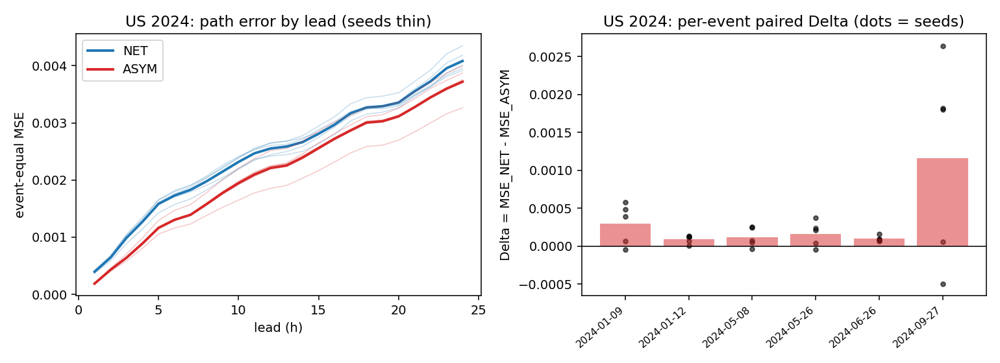
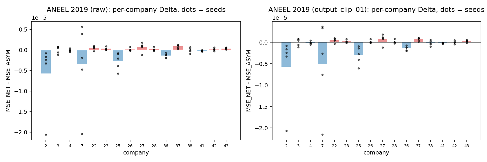
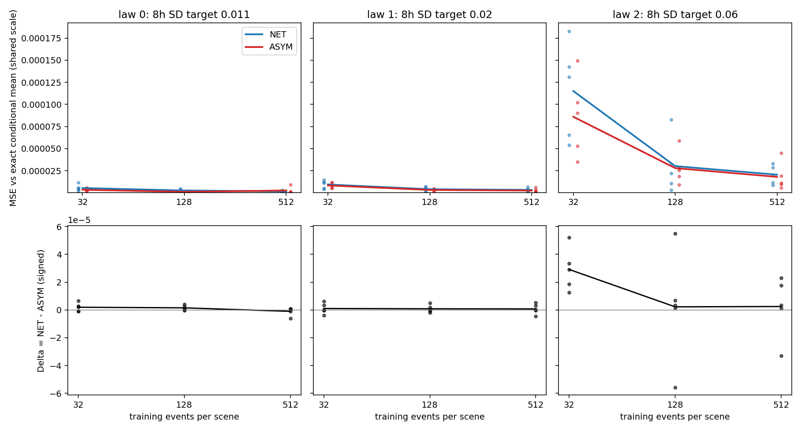
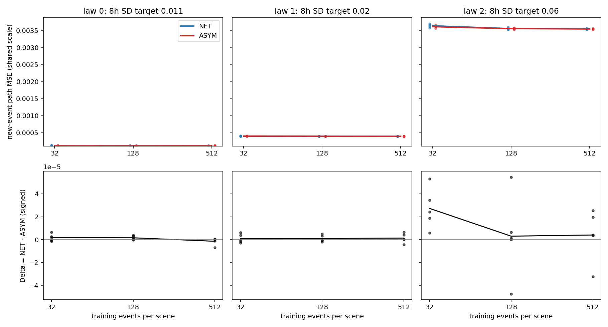

# NET / ASYM 神经实验结果（2026-09-12 轮）

分支：`research/net-asym-neural-era5-20260912`。基准：`aneel-open-data@de406e16`。
比较方向固定为 **Δ = MSE_NET − MSE_ASYM**，正数支持双流 ASYM，负数支持单净流 NET。
所有区间都是回顾性数据上的描述性依赖敏感性，不是新鲜数据上的显著性检验。

## 提交链（按时间顺序）

| commit | 内容 |
|---|---|
| `1825054e` | 协议、数据盘点与逐字节审计、US split 与窗口索引锁、ANEEL 选参修复锁 |
| `2262a095` | NET/ASYM 实现、50 项测试、实测正确性闸门、profile |
| `d5caf8b8` | 分析脚本，在任何评价结果出现之前提交 |
| `81432c64` | synthetic 选参锁，在 synthetic final 之前提交 |
| `a7d94a17` | US 选参锁，在 US final 之前提交 |
| 本提交（分支 HEAD） | 实际结果、预测分片、checkpoint、事后描述性参考、图和解释 |

## 模型（仅两种）

- **NET**：`y[k+1] = y[k] + scale · net(context, x[k], y[k]/scale)`，读取自身递推状态，是一般净响应，不是 signed single-rate。
- **ASYM**：`(u, r, stay) = softmax(rate_logits(context, x[k]), 0)`，`y[k+1] = y[k] + u(1−y[k]) − r·y[k]`，率函数不读递推状态。
- 两者都来自审计过的包核心，完整路径平方损失训练，没有 teacher forcing、方向标签或事故结束信息。

## 结论一览（Δ = MSE_NET − MSE_ASYM，正数支持 ASYM）

| 任务 | 主结果 | 支持 ASYM | 支持 NET | 未决 / 限定 |
|---|---|---|---|---|
| A. 美国 EAGLE-I + ERA5（2024，回顾性，给定再分析天气） | Δ path = +3.23e-04（NET 2.472e-03，ASYM 2.149e-03） | 5/5 seed、6/6 事件、5/5 重叠分量为正；分量重采样区间 [+1.20e-04, +7.46e-04]；三个端点都为正；输出裁剪后仍为正；事后参考：合计方向在未训练时相反（Δ=−2.67e-04），仅因 2024-09-27；其余 5 个事件的优势在回归初始化中已部分存在 | 高 y0、弱未来阵风的条件格偏向 NET（4/5 seed）；198/1,240 个县-事件偏向 NET；NET 在 1 h、6 h 比持久性更差（对 NET 不利） | 只有 5 个独立分量，精确 sign-flip p 最小为 0.0625；幅度主要来自 2024-09-27；只覆盖有真实天气的县 |
| B. ANEEL（2019，复用回顾性评价） | Δ path = −6.44e-07 | 16 家公司中 9 家、24 个 collection 中 15 个 Δ>0；mean-company-relative gain +0.066% | 公司等权总体、168 h 块区间 [−1.12e-06, −1.33e-07]、留一 seed、三个端点都偏向 NET；ratio-of-means gain −0.38% | 总体差异由三家高误差公司主导（贡献 115%），各公司方向不一致 |
| C. Synthetic（精确混合律） | 只有 law 2（8 h SD .06）、n=32 一格 5/5 seed 一致 | 该格 Δ vs μ0 = +2.91e-05（ASYM 估计误差低 25%）；24 h、32 h 端点 9/9 格；Δ 与噪声/n 的秩相关 0.83 | 6 h 端点 7/9 格；γ=0 对照 law 1（4/5 seed） | 其余 8 个主网格格子和 3 个对照格 seed 方向不一致，p ≥ 0.125；两模型类都能精确表示 μ0 |

## A. 美国 EAGLE-I + ERA5：给定再分析天气的条件响应（2024 回顾性评价）

合同为 RETROSPECTIVE_KNOWN_REANALYSIS_CONDITIONAL_RESPONSE：两个模型都读取未来 24 h 的 ERA5 再分析路径。这是回顾性的条件响应拟合，不是预测时可得天气的部署实验。2024 是既有研究接触过的回顾性资料，不叫 fresh holdout。

### 实际运行了什么

- **数据与窗口。** 26 对 panel/driver 文件逐对打开核验（`intake/US_DATA_AUDIT.json`）。L=24、H=24，起点每 6 h，状态取 15 分钟库存的精确 UTC 整点快照。只有 49 个所需状态和全部输入天气都合法的窗口才进入，两模型使用同一份窗口清单。
- **冻结划分。**
  - train 2018–2021：14 个事件，3,427 个县-事件，60,707 个窗口。
  - validation 2022：6 个事件，32,907 个窗口。
  - evaluation 2024：6 个事件，1,240 个县-事件，25,430 个窗口。

  同一 (FIPS, origin) 的 972 个重复窗口按较早事件保留，并保存了映射；跨 split 泄漏检查结果为无。2024 的 6 个事件构成 5 个重叠连通分量（2024-01-09 与 2024-01-12 相连）。
- **调参。** 6 个候选 × DEV seeds 8101–8103 × 2 模型，共 36 次。只用 2018–2021 拟合、2022 验证，每 250 更新验证一次，最多 3000 更新。选参锁在任何 final 拟合之前随 commit `a7d94a17` 提交：
  - NET：p32768 / lr 1e-3 / 2750 更新（宽度 48，32,633 参数）。
  - ASYM：p32768 / lr 1e-3 / 1000 更新（宽度 47，32,534 参数）。
- **final。** seeds 8201–8205 × 2 模型，共 10 次，仍只用 2018–2021 拟合；2024 只在锁定之后评分。预测按模型 / seed / 事件分片保存在 `predictions/us_era5/`，真值与评分权重在 `predictions/us_era5/truth/`。
- **核查。**
  - 10 个 checkpoint 纯重放与保存的分片逐位一致（最大差 0.0）。
  - 独立评分器（pandas 分组）与训练驱动的权重向量评分器相差 0 和 6.5e-19。
  - 同一配对 seed 下，两模型抽到的 batch 样本 ID 相同。

### 主表（event → county → origin → lead 逐级等权；先逐 seed 算平方损失，再对五个 seed 平均）

| 口径 | 模型 | path MSE | 1h | 6h | 24h | 越界比例 |
|---|---|---:|---:|---:|---:|---:|
| raw | NET | 2.4718e-03 | 3.9480e-04 | 1.7286e-03 | 4.0822e-03 | 33.91% |
| raw | ASYM | 2.1492e-03 | 1.8700e-04 | 1.3033e-03 | 3.7200e-03 | 0.00% |
| clip[0,1] | NET | 2.4487e-03 | 3.5443e-04 | 1.7116e-03 | 4.0602e-03 | 0.00% |
| clip[0,1] | ASYM | 2.1492e-03 | 1.8700e-04 | 1.3033e-03 | 3.7200e-03 | 0.00% |
| raw | PERSISTENCE（零训练参考，事后计算） | 2.6268e-03 | 1.9012e-04 | 1.4522e-03 | 4.7836e-03 | 0 |

PERSISTENCE（整条路径保持 y0）是看到结果后计算的零训练参考，不是学习模型，不参与任何选择。越界比例是预测值落在 [0,1] 之外的比例，同样逐级等权。

### 配对风险差 Δ = MSE_NET − MSE_ASYM

| 口径 | Δ path（seed 均值） | 重叠分量重采样 95% 描述区间 | Δ>0 的 seed | Δ>0 的分量 | Δ>0 的事件 | 分量 exact sign-flip p | mean-event-relative gain | ratio-of-event-means gain |
|---|---:|---:|---:|---:|---:|---:|---:|---:|
| raw | +3.225e-04 | [+1.20e-04, +7.46e-04] | 5/5 | 5/5 | 6/6 | 0.0625（最小可达 0.0625） | +20.09% | +13.05% |
| clip[0,1] | +2.994e-04 | [+9.37e-05, +7.33e-04] | 5/5 | 5/5 | 6/6 | 0.0625（最小可达 0.0625） | +17.05% | +12.23% |

端点 Δ（seed 均值）：raw：1h +2.08e-04，6h +4.25e-04，24h +3.62e-04；clip[0,1]：1h +1.67e-04，6h +4.08e-04，24h +3.40e-04。

区间来自 4,000 次按事件重叠分量的有放回重采样：每次先在 seed 内对抽中的事件等权求 Δ，再对 seed 平均。只有 5 个分量，所以精确 sign-flip 检验最小只能得到 p=0.0625。区间和 p 都只是回顾性数据上的依赖敏感性，不是新鲜数据上的显著性检验。

两个相对口径在这里同号，但仍是不同的量：
- mean-event-relative gain 是逐事件 (NET−ASYM)/NET 的平均。
- ratio-of-event-means gain 是事件等权均值之比。

### 逐事件结果（raw）

| 事件 | 分量 | 窗口 | 县 | PERSISTENCE path | NET path | ASYM path | Δ path | Δ 的 seed SD | Δ>0 seed | NET 1h | ASYM 1h | NET 24h | ASYM 24h | NET 越界 |
|---|---:|---:|---:|---:|---:|---:|---:|---:|---:|---:|---:|---:|---:|---:|
| 2024-01-09 | 0 | 2520 | 120 | 7.932e-04 | 1.082e-03 | 7.870e-04 | +2.95e-04 | 2.70e-04 | 4/5 | 2.833e-04 | 1.176e-04 | 2.057e-03 | 1.225e-03 | 39.2% |
| 2024-01-12 | 0 | 5967 | 288 | 5.665e-04 | 5.381e-04 | 4.444e-04 | +9.37e-05 | 5.54e-05 | 5/5 | 2.689e-04 | 5.090e-05 | 7.678e-04 | 6.789e-04 | 40.3% |
| 2024-05-08 | 1 | 3481 | 166 | 2.741e-04 | 3.869e-04 | 2.688e-04 | +1.18e-04 | 1.28e-04 | 4/5 | 2.596e-04 | 1.105e-04 | 5.056e-04 | 3.554e-04 | 30.4% |
| 2024-05-26 | 2 | 4864 | 256 | 3.827e-03 | 3.416e-03 | 3.252e-03 | +1.64e-04 | 1.66e-04 | 4/5 | 5.342e-04 | 3.320e-04 | 5.205e-03 | 5.129e-03 | 29.8% |
| 2024-06-26 | 3 | 2940 | 140 | 4.122e-04 | 3.584e-04 | 2.592e-04 | +9.93e-05 | 3.50e-05 | 5/5 | 1.957e-04 | 8.414e-05 | 5.608e-04 | 4.211e-04 | 50.9% |
| 2024-09-27 | 4 | 5658 | 270 | 9.888e-03 | 9.049e-03 | 7.884e-03 | +1.17e-03 | 1.32e-03 | 4/5 | 8.270e-04 | 4.269e-04 | 1.540e-02 | 1.451e-02 | 12.9% |

去掉任一重叠分量后，剩余事件的等权 Δ：

| 移除的重叠分量 | 剩余事件等权 Δ path | Δ>0 的 seed |
|---|---:|---:|
| 2024-01-09 + 2024-01-12 | +3.87e-04 | 4/5 |
| 2024-05-08 | +3.63e-04 | 5/5 |
| 2024-05-26 | +3.54e-04 | 5/5 |
| 2024-06-26 | +3.67e-04 | 5/5 |
| 2024-09-27 | +1.54e-04 | 5/5 |



左图是逐时距的事件等权 MSE（粗线为 seed 均值，细线为单个 seed）；右图是逐事件 Δ（柱为 seed 均值，点为单个 seed）。

### 不利于 ASYM 的案例

- **seed 层面：** 6 个事件中有 4 个各有一个 seed 的 Δ<0；30 个事件-seed 配对中 26 个为正。
- **县层面：** 1,240 个县-事件中 198 个 Δ<0。|Δ| 最大的县全部在 2024-09-27，两个方向都有：

| 方向 | 事件 | FIPS | Δ path（seed 均值） | 起点数 |
|---|---|---|---:|---:|
| NET 更好 | 2024-09-27 | 37189 | -1.62e-02 | 21 |
| NET 更好 | 2024-09-27 | 51173 | -1.54e-02 | 21 |
| NET 更好 | 2024-09-27 | 21165 | -1.26e-02 | 21 |
| NET 更好 | 2024-09-27 | 51185 | -1.26e-02 | 21 |
| NET 更好 | 2024-09-27 | 54055 | -1.19e-02 | 21 |
| ASYM 更好 | 2024-09-27 | 13073 | +3.53e-02 | 21 |
| ASYM 更好 | 2024-09-27 | 13245 | +3.15e-02 | 21 |
| ASYM 更好 | 2024-09-27 | 51045 | +2.70e-02 | 21 |
| ASYM 更好 | 2024-09-27 | 45045 | +2.25e-02 | 21 |
| ASYM 更好 | 2024-09-27 | 45083 | +2.04e-02 | 21 |

| 事件 | 县-事件 | Δ>0 | Δ<0 | Δ 中位数 |
|---|---:|---:|---:|---:|
| 2024-01-09 | 120 | 106 | 14 | +2.12e-04 |
| 2024-01-12 | 288 | 234 | 54 | +8.92e-05 |
| 2024-05-08 | 166 | 150 | 16 | +6.68e-05 |
| 2024-05-26 | 256 | 214 | 42 | +7.91e-05 |
| 2024-06-26 | 140 | 137 | 3 | +4.95e-05 |
| 2024-09-27 | 270 | 201 | 69 | +1.65e-04 |
| 合计 | 1240 | 1042 | 198 | +8.55e-05 |

- **条件分组：** 当前停电比例高于 train 90% 分位、且给定的未来 24 h 最大阵风低于 train 下三分位的窗口里，NET 更好（Δ=−6.13e-04，5 个 seed 中 4 个偏向 NET）。详见下一节。

### 训练期定义的条件分组（描述性）

分组规则只用输入和训练期分位数，不使用任何评价期标签：
- 当前状态 y0 按 train 窗口的 50% / 90% 分位分三组。train 中位数为 0，所以第一组就是 y0=0。
- 给定的未来 24 h 最大 gust 按 train 三分位分三组，单位与驱动文件中的 gust 通道相同。

读表时注意：
- 格内风险是窗口均值，不是主表的事件等权估计量。
- 每格都包含全部 6 个事件和 5 个分量，但格内窗口并不独立。
- 组内目标 SD 表明同一格内的响应差异仍然很大，所以这些格子不能当作“相同 x”；本轮也没有估计 Λ 或有效样本量。

| 当前状态 y0（train 分位） | 给定未来 24h 最大 gust（train 三分位） | 窗口 | 县-事件 | 事件 | 分量 | 组内目标 SD | NET 窗口均值 path MSE | ASYM | Δ | Δ>0 seed |
|---|---|---:|---:|---:|---:|---:|---:|---:|---:|---:|
| y0 = 0 | ≤ 8.95 | 2358 | 783 | 6 | 5 | 0.0115 | 1.575e-04 | 1.330e-04 | +2.45e-05 | 5/5 |
| y0 = 0 | (8.95, 12.74] | 4704 | 998 | 6 | 5 | 0.0204 | 4.704e-04 | 4.201e-04 | +5.03e-05 | 5/5 |
| y0 = 0 | > 12.74 | 4976 | 1016 | 6 | 5 | 0.0575 | 3.356e-03 | 2.999e-03 | +3.57e-04 | 5/5 |
| 0 < y0 ≤ 0.0127 | ≤ 8.95 | 2044 | 669 | 6 | 5 | 0.0086 | 7.451e-05 | 7.246e-05 | +2.04e-06 | 1/5 |
| 0 < y0 ≤ 0.0127 | (8.95, 12.74] | 3359 | 910 | 6 | 5 | 0.0137 | 2.706e-04 | 1.916e-04 | +7.90e-05 | 5/5 |
| 0 < y0 ≤ 0.0127 | > 12.74 | 4130 | 995 | 6 | 5 | 0.0809 | 5.610e-03 | 4.956e-03 | +6.54e-04 | 3/5 |
| y0 > 0.0127 | ≤ 8.95 | 1138 | 230 | 6 | 5 | 0.1747 | 4.739e-03 | 5.353e-03 | -6.13e-04 | 1/5 |
| y0 > 0.0127 | (8.95, 12.74] | 1193 | 376 | 6 | 5 | 0.1784 | 4.739e-03 | 4.462e-03 | +2.77e-04 | 3/5 |
| y0 > 0.0127 | > 12.74 | 1528 | 593 | 6 | 5 | 0.2024 | 1.419e-02 | 1.108e-02 | +3.11e-03 | 4/5 |

### 事后描述性参考：未训练模型、持久性与验证曲线

本节在看到评价结果之后计算（`code/posthoc_descriptives.py` → `results/POSTHOC_DESCRIPTIVES.json`）。它不改变任何锁定的估计量、选择或结论口径，只用于解释主结果。

**未训练模型的重建。** 按 `train_run` 的顺序（`torch.manual_seed(seed)` 后 `build_model`）重建 update 0 的模型。重建出的 2022 验证损失与试验登记中的值逐位一致（最大差 0.0）。两者的初始状态来自审计过的包核心：
- ASYM 被初始化为以每小时 5% 向训练期 source mean（0.01446）回归的路径（u=0.05π，r=0.05(1−π)，stay=0.95）。
- NET 的初始增量近似为 0，也就是近似持久性。

| 路径（五个 seed 均值） | 更新数 | 2022 验证 path MSE | 2024 path MSE | 2024 1h | 2024 6h | 2024 24h | 2024 越界 |
|---|---:|---:|---:|---:|---:|---:|---:|
| PERSISTENCE（整条路径保持 y0） | — | 5.964e-04 | 2.6268e-03 | 1.9012e-04 | 1.4522e-03 | 4.7836e-03 | 0 |
| NET 未训练（update 0） | 0 | 5.972e-04 | 2.6300e-03 | 1.9012e-04 | 1.4524e-03 | 4.7936e-03 | 36.2% |
| NET 训练后（锁定 final） | 2750 | 5.785e-04 | 2.4718e-03 | 3.9480e-04 | 1.7286e-03 | 4.0822e-03 | 33.9% |
| ASYM 未训练（update 0） | 0 | 4.520e-04 | 2.8971e-03 | 1.9172e-04 | 1.5786e-03 | 5.1381e-03 | 0.0% |
| ASYM 训练后（锁定 final） | 1000 | 4.973e-04 | 2.1492e-03 | 1.8700e-04 | 1.3033e-03 | 3.7200e-03 | 0.0% |

未训练模型的 Δ 逐 seed：8201 -2.72e-04，8202 -2.58e-04，8203 -2.72e-04，8204 -2.76e-04，8205 -2.57e-04；均值 -2.67e-04。训练后 Δ 的均值为 +3.23e-04。

**未训练时的方向。** 事件等权合计时，未训练的 NET 反而更好（Δ=−2.67e-04，5/5 seed 为负），训练后 Δ=+3.23e-04。未训练 ASYM 的 2024 风险（2.897e-03）比持久性（2.627e-03）还差，训练使它降低 26%；NET 的训练只降低 6%。但合计方向的翻转只来自 2024-09-27，逐事件看：

| 事件 | PERSISTENCE | NET 未训练 | NET 训练后 | ASYM 未训练 | ASYM 训练后 | Δ 未训练 | Δ 训练后 |
|---|---:|---:|---:|---:|---:|---:|---:|
| 2024-01-09 | 7.932e-04 | 7.951e-04 | 1.082e-03 | 5.986e-04 | 7.870e-04 | +1.96e-04 | +2.95e-04 |
| 2024-01-12 | 5.665e-04 | 5.679e-04 | 5.381e-04 | 4.190e-04 | 4.444e-04 | +1.49e-04 | +9.37e-05 |
| 2024-05-08 | 2.741e-04 | 2.751e-04 | 3.869e-04 | 2.240e-04 | 2.688e-04 | +5.12e-05 | +1.18e-04 |
| 2024-05-26 | 3.827e-03 | 3.835e-03 | 3.416e-03 | 3.154e-03 | 3.252e-03 | +6.81e-04 | +1.64e-04 |
| 2024-06-26 | 4.122e-04 | 4.134e-04 | 3.584e-04 | 2.894e-04 | 2.592e-04 | +1.24e-04 | +9.93e-05 |
| 2024-09-27 | 9.888e-03 | 9.894e-03 | 9.049e-03 | 1.270e-02 | 7.884e-03 | -2.80e-03 | +1.17e-03 |

- 2024-09-27 上未训练的 Δ 为 −2.80e-03：向训练均值回归会把高停电水平过快拉低。这个事件上的 ASYM 优势（训练后 +1.17e-03）是训练产生的。
- 其余 5 个事件里，未训练的 ASYM（回归初始化）已经优于未训练的 NET（近似持久性），未训练 Δ 在 +5.1e-05 到 +6.8e-04 之间。其中 3 个事件（2024-01-12、2024-05-26、2024-06-26）训练后的 Δ 反而更小。
- 因此，低停电事件上的 ASYM 优势有相当一部分在初始化时就已存在，来自向训练均值回归的先验，而不是学到的天气条件响应。

**训练的收益与代价按事件分开。**
- 训练后的 ASYM 在 2024-01-09、2024-01-12、2024-05-08、2024-05-26 四个事件上不如自己的初始化。净收益几乎全部来自高停电事件 2024-09-27，2024-06-26 有小幅改善。
- 训练后的 NET 在 2024-01-09 和 2024-05-08 两个事件上不如持久性。

**NET 的短时距问题。**
- NET 的 1 h 误差是持久性的 2.08 倍（3.948e-04 对 1.901e-04），6 h 比持久性差 19%，到 24 h 才优于持久性。
- NET 有 33.9% 的输出低于 0：28.8% 低于 −0.001，3.3% 低于 −0.01，负输出的中位数为 −0.0037。高于 1 的只有 0.003%。
- 统一裁剪到 [0,1] 后，NET 的 path MSE 只下降 0.9%，所以越界不是两模型差距的主要来源。
- ASYM 的 1 h 误差（1.870e-04）与持久性相当。

**2022 验证曲线。** DEV 行是锁定配置的 3 个 seed；final 行的曲线只记录，不用于停止。

| 阶段 | 模型 | seed 数 | update 0 的 2022 验证 MSE | 训练后最低（均值） | 最低点所在更新 | 最后一点（均值） | 最后更新 | 最低相对 update 0 | 最后相对 update 0 |
|---|---|---:|---:|---:|---:|---:|---:|---:|---:|
| dev | ASYM | 3 | 4.520e-04 | 4.469e-04 | 1750, 250, 1000 | 4.587e-04 | 3000 | -1.12% | +1.49% |
| dev | NET | 3 | 5.978e-04 | 5.262e-04 | 1000, 2750, 3000 | 5.905e-04 | 3000 | -11.98% | -1.21% |
| final | NET | 5 | 5.972e-04 | 5.339e-04 | 1750, 1500, 1250, 1500, 2750 | 5.785e-04 | 2750 | -10.59% | -3.13% |
| final | ASYM | 5 | 4.520e-04 | 4.633e-04 | 250, 500, 1000, 500, 500 | 4.973e-04 | 1000 | +2.50% | +10.01% |

- NET 训练中的最低验证损失比初始化低 10.6%–12.0%，最后一点仍低 1.2%–3.1%。
- ASYM 在 DEV 中的最低点只比初始化低 1.1%。在 final 的 5 个 seed 上，平均曲线在每个记录点都高于初始化：逐 seed 最低点的均值高 2.5%，最后一点高 10%。
- 锁定规则要求至少 250 更新，本轮按规则执行，未作修改。

### 结论（仅限此 cohort、信息合同和有真实天气覆盖的县）

**支持 ASYM。** 在锁定配置、完整路径监督和给定再分析天气下，2024 事件等权路径风险偏向 ASYM：
- Δ=+3.23e-04；5/5 seed、6/6 事件、5/5 重叠分量为正，分量重采样区间不含 0。
- 1 / 6 / 24 h 端点都为正；两个相对口径分别为 +20.1% 和 +13.0%。
- NET 输出裁剪后 Δ 仍为 +2.99e-04；去掉 2024-09-27 后仍为 +1.54e-04（5/5 seed）。
- 事后参考显示：合计方向在未训练时相反，训练后的净优势来自 2024-09-27 上学到的响应；其余 5 个事件中，相当一部分 ASYM 优势在未训练的回归初始化里已经存在。

**支持 NET。**
- 高当前停电、弱未来阵风的条件格偏向 NET（描述性）。
- 198/1,240 个县-事件偏向 NET，|Δ| 最大的集中在 2024-09-27。

**对 NET 不利的附带发现。** NET 在 1 h 和 6 h 端点上比零训练持久性更差，在 2 个事件的整条路径上也比持久性差，约三分之一的输出为负。

**未决。**
- 独立单位只有 5 个分量，精确检验不可能达到 p<0.05。
- Δ 的幅度主要由 2024-09-27 一个分量决定：该分量 Δ=+1.17e-03，其余分量在 9.9e-05 到 1.94e-04 之间。
- 训练对 ASYM 是一个权衡：高停电事件改进，低停电事件退化。2022 验证上训练后的 ASYM 没有优于自己的初始化，所以这个方向对评价期的事件组成敏感。
- 低停电事件上的 ASYM 优势，有多少来自学到的天气响应、多少来自回归初始化，本轮无法分开。
- 选参与预算处在边缘：ASYM 的选参领先仅 0.34%，锁定预算只有 1000 更新；NET 有一个 DEV seed 在 3000 更新上限处达到最优。这些都可能影响幅度。
- 结论不能外推到 1,265 个缺天气的县，也不能外推到预测天气。

## B. ANEEL：修复配置的配对评价（2019 为复用回顾性评价）

### 实际运行了什么

- 选参修复只用已有 2018 表，按 `(model, config_id)` 双键重算，并在任何 2019 评分之前随 commit `1825054e` 锁定：NET p32768 / lr 3e-4 / 3500 更新，ASYM p8192 / lr 1e-3 / 1000 更新，final seeds 5101–5105。
- 10 个本地修复 checkpoint 逐个核验：元数据与协议 §5.3 一致，拟合统计量与 full-2018 一致；checkpoint-only 重放与修复预测**逐位一致（最大差 0.0）**。
- 每个模型取 seed 5101 用 8 线程从头重训，与 checkpoint **逐位一致（0.0）**，训练过程可复现。
- 独立评分器（pandas 分组实现）与包内评分器差 0.0。
- 没有补跑 DIRECT、SR 或一步训练消融，没有新调参。

### 主表（公司等权，五个配对 seed 均值）

| 口径 | 模型 | path MSE | 1h | 6h | 24h | 越界比例 |
|---|---|---:|---:|---:|---:|---:|
| raw | NET | 1.693816e-04 | 1.082186e-04 | 1.696589e-04 | 1.767136e-04 | 4.87% |
| raw | ASYM | 1.700257e-04 | 1.135677e-04 | 1.712449e-04 | 1.768978e-04 | 0 |
| raw | PERSISTENCE | 3.055821e-04 | 1.341721e-04 | 3.044726e-04 | 3.363475e-04 | 0 |
| clip[0,1] | NET | 1.692066e-04 | 1.082101e-04 | 1.695431e-04 | 1.764878e-04 | 0 |
| clip[0,1] | ASYM | 1.700257e-04 | 1.135677e-04 | 1.712449e-04 | 1.768978e-04 | 0 |

### 配对风险差 Δ = MSE_NET − MSE_ASYM（正数支持双流）

| 口径 | Δ path（seed 均值） | 168h 共同日历块 95% 描述区间 | Δ>0 的 seed | 留一 seed 后均为负 |
|---|---:|---|---:|---|
| raw | −6.44e-07 | [−1.12e-06, −1.33e-07] | 1/5 | 是 |
| clip[0,1] | −8.19e-07 | [−1.22e-06, −4.38e-07] | 1/5 | 是 |

端点 Δ（raw）：1h −5.35e-06，6h −1.59e-06，24h −1.84e-07，三个端点都是 NET 更好。

两个相对口径**方向相反，不能互换**：mean-company-relative gain 为 +0.066%（偏向 ASYM），ratio-of-means gain 为 −0.38%（偏向 NET）；clip 后分别为 −0.089% 与 −0.48%。

### 异质性（逐公司 / 逐 collection）

- 16 家公司中 9 家的 seed 均值 Δ > 0；3 家在五个 seed 中全部偏向 ASYM，4 家全部偏向 NET。
- 24 个 collection 中 15 个 Δ > 0，范围 [−5.85e-06, +1.25e-06]。
- |Δ| 最大的三家公司（2、7、25）全部偏向 NET，合计贡献公司 Δ 总和的 115%。公司 NET 误差水平与 Δ 的 Spearman 为 −0.51：误差大的公司偏向 NET，误差小的公司略偏向 ASYM。这正是两个相对口径方向相反的原因。



图中每家公司一根柱（seed 均值），点为单个 seed；左为 raw，右为 clip[0,1]。逐公司、逐 collection 的完整配对差在 `results/aneel/ANEEL_COMPANY_PAIRED_DELTA.csv`、`ANEEL_COMPANY_PAIRED_DELTA_SEED_MEAN.csv` 和 `ANEEL_COLLECTION_PAIRED_DELTA.csv`；描述性异质性在 `ANEEL_COMPANY_DETAIL.csv` 与 `ANEEL_DESCRIPTIVE_DETAIL.json`。

### 结论（仅限此 cohort、信息合同与修复配置）

- **负结果（对 ASYM）：** 公司等权总体路径风险偏向 NET，块敏感性区间不含 0，留一 seed 不改变符号，三个端点都是 NET 更好。
- **未决：** 多数公司和 collection 表现为很小的 ASYM 优势，总体差异由少数高误差公司主导。按公司的方向不能一概而论。
- 2019 已被反复使用，这些区间只是描述性依赖敏感性，不是新鲜数据上的显著性检验。calendar 分组不等于同天气，本任务没有控制天气。

## C. Synthetic：精确二项源池混合律上的实际神经比较

### 实际运行了什么

**生成器（`code/synth_generator.py`）。** 按协议 §6 实现：
- H=32；三个场景的 x[k] 分别在前 4、8、12 h 为 1，之后为 0。
- u=.06、r=.20、γ=.04（对照 γ=0）、M0=16、K0=0。
- damage 与 restore 在当前状态下从两个不重叠源池独立抽二项。
- L=32 个等大块；每个事件只抽一次 B~Bernoulli(ρ)。
- 有限状态 evaluator 枚举 K=0..16，用两个二项分布的卷积建立转移矩阵，前向传播得到 μ0，再用跨时点转移矩阵乘积得到完整 Σ0。

**独立 Monte Carlo 核查。** 只用核查专用随机流，结果在 `results/synthetic/EXACT_LAW_CALIBRATION.json`，所有路径都在 [0,1] 内：
- 单块：六个“场景 × γ”各 400,000 条路径。均值最大绝对误差 ≤ 3.8e-4（逐时 SE 最大约 1.7e-4），协方差相对 Frobenius 误差 ≤ 0.48%。
- 混合律：三个律在 8 h 场景下各 60,000 个事件。经验 B 频率与 ρ 一致，均值误差 ≤ 7.3e-4，协方差相对误差 ≤ 2.2%，迹比 0.993–0.996。
- 无外部作用时，零初态保持为零。
- 第一步均值 0.0601，精确值 0.06。

**标定。** 8 h 场景、γ=.04 的单块 sd0 = 0.060878。三个律的 c 和 ρ 见下表，ρ 全部在 [0,1] 内，没有截断。另外两个场景和 γ=0 对照复用同一组 c，实际条件路径 SD 按场景重新报告，不沿用 0.011 / 0.020 / 0.060 的标签。

| law | 8h 目标 SD | c | ρ | ρ∈[0,1] | 4h γ=.04 | 8h γ=.04 | 12h γ=.04 | 4h γ=0 | 8h γ=0 | 12h γ=0 |
|---:|---:|---:|---:|---:|---:|---:|---:|---:|---:|---:|
| 0 | 0.011 | 0.03265 | 0.001443 | 是 | 0.0082 | 0.0110 | 0.0131 | 0.0080 | 0.0107 | 0.0127 |
| 1 | 0.02 | 0.10793 | 0.079151 | 是 | 0.0149 | 0.0200 | 0.0238 | 0.0145 | 0.0194 | 0.0230 |
| 2 | 0.06 | 0.97135 | 0.970427 | 是 | 0.0446 | 0.0600 | 0.0713 | 0.0436 | 0.0583 | 0.0691 |

实际条件均值与跨时相关结构（相关结构只由 Σ0 决定，三个律相同）：

| 场景 | 单块 sd0 | μ0 最大值（位置） | μ0 在 1 / 6 / 24 / 32 h | 平均跨时相关 lag 1 / 4 / 8 / 16 |
|---|---:|---:|---:|---:|
| 4 h 场景，γ=0.04 | 0.0453 | 0.1633（第 4 h） | 0.0600 / 0.1066 / 0.0021 / 0.0004 | 0.87 / 0.61 / 0.39 / 0.16 |
| 8 h 场景，γ=0.04 | 0.0609 | 0.2156（第 8 h） | 0.0600 / 0.1966 / 0.0067 / 0.0012 | 0.85 / 0.56 / 0.35 / 0.13 |
| 12 h 场景，γ=0.04 | 0.0723 | 0.2329（第 12 h） | 0.0600 / 0.1966 / 0.0175 / 0.0030 | 0.83 / 0.52 / 0.30 / 0.10 |
| 4 h 场景，γ=0 | 0.0442 | 0.1616（第 4 h） | 0.0600 / 0.1034 / 0.0019 / 0.0003 | 0.87 / 0.60 / 0.38 / 0.15 |
| 8 h 场景，γ=0 | 0.0592 | 0.2100（第 8 h） | 0.0600 / 0.1929 / 0.0059 / 0.0010 | 0.84 / 0.55 / 0.33 / 0.12 |
| 12 h 场景，γ=0 | 0.0702 | 0.2245（第 12 h） | 0.0600 / 0.1929 / 0.0154 / 0.0026 | 0.82 / 0.50 / 0.28 / 0.09 |

**调参。** DEV seeds 6201–6203，只在 law 1、n=128、γ=.04 的三场景混合环境上运行，6 个候选 × 3 seeds × 2 模型，共 36 次。验证指标是三场景等权的新事件 path MSE，不使用 μ0。选参锁在 final 之前随 commit `81432c64` 提交：
- NET：p32768 / lr 3e-3 / 2500 更新（宽度 163，32,799 参数）。
- ASYM：p32768 / lr 3e-3 / 2000 更新（宽度 163，32,833 参数）。

**final。** 120 次全部完成，checkpoint-only 重放 120/120 逐位一致：
- 主网格：3 律 × n∈{32, 128, 512} × seeds 7201–7205 × 2 模型，共 90 次。
- γ=0 对照：n=128，3 律 × 5 seeds × 2 模型，共 30 次。
- 每个 seed 由 SeedSequence 派生独立的训练池，以及每场景 512 个 validation、512 个 calibration、2048 个 test 事件。
- 同一 seed 下两模型使用同一数据和同一 minibatch 事件 ID；不同 n 取同一训练池的前缀。

**输入与评价。** 网络只读取完整 x[0:H]、逐步 (x[k], k/H) 和 y0=0，不读取 M0、L、ρ、c、γ、B、未来真实 Y 或精确分布。两种风险分开报告：
- 对新事件真实路径的 path MSE，含不可约噪声。
- 对精确条件均值 μ0 的 path MSE，即估计误差。

### 主网格（γ=.04；五个配对 seed 的均值；Δ = NET − ASYM）

| law | 三场景平均路径 SD | n/场景 | NET vs μ0 | ASYM vs μ0 | Δ vs μ0 | Δ/NET | Δ 的 seed SD | Δ>0 seed | sign-flip p | NET 新事件 path MSE | Δ 新事件 | Δ>0 seed（新事件） | μ0 本身的新事件风险 |
|---:|---:|---:|---:|---:|---:|---:|---:|---:|---:|---:|---:|---:|---:|
| 0 | 0.0109 | 32 | 5.337e-06 | 3.385e-06 | +1.95e-06 | +36.6% | 3.06e-06 | 3/5 | 0.2500 | 1.2532e-04 | +1.76e-06 | 3/5 | 1.2011e-04 |
| 0 | 0.0109 | 128 | 2.561e-06 | 1.042e-06 | +1.52e-06 | +59.3% | 1.74e-06 | 4/5 | 0.1250 | 1.2271e-04 | +1.61e-06 | 4/5 | 1.2011e-04 |
| 0 | 0.0109 | 512 | 1.578e-06 | 2.588e-06 | -1.01e-06 | -64.0% | 2.92e-06 | 3/5 | 0.7500 | 1.2149e-04 | -1.42e-06 | 2/5 | 1.2011e-04 |
| 1 | 0.0199 | 32 | 9.351e-06 | 8.302e-06 | +1.05e-06 | +11.2% | 3.79e-06 | 2/5 | 0.7500 | 4.0309e-04 | +1.04e-06 | 2/5 | 3.9386e-04 |
| 1 | 0.0199 | 128 | 4.014e-06 | 3.171e-06 | +8.43e-07 | +21.0% | 2.69e-06 | 2/5 | 0.7500 | 3.9835e-04 | +1.01e-06 | 2/5 | 3.9386e-04 |
| 1 | 0.0199 | 512 | 3.249e-06 | 2.486e-06 | +7.63e-07 | +23.5% | 3.75e-06 | 3/5 | 0.6875 | 3.9742e-04 | +1.38e-06 | 4/5 | 3.9386e-04 |
| 2 | 0.0596 | 32 | 1.151e-04 | 8.598e-05 | +2.91e-05 | +25.3% | 1.53e-05 | 5/5 | 0.0625 | 3.6447e-03 | +2.73e-05 | 5/5 | 3.5343e-03 |
| 2 | 0.0596 | 128 | 3.016e-05 | 2.792e-05 | +2.24e-06 | +7.4% | 3.93e-05 | 4/5 | 0.6250 | 3.5617e-03 | +3.04e-06 | 3/5 | 3.5343e-03 |
| 2 | 0.0596 | 512 | 2.044e-05 | 1.797e-05 | +2.47e-06 | +12.1% | 2.19e-05 | 4/5 | 0.8125 | 3.5543e-03 | +4.07e-06 | 4/5 | 3.5343e-03 |

- “μ0 本身的新事件风险”是精确条件均值对同一批 test 路径的风险，也就是新事件风险中不可约的部分。NET 的新事件风险只比它高 0.6%–4.3%，所以新事件 Δ 与 vs μ0 的 Δ 数值接近，但前者多了 test 抽样噪声。
- sign-flip p 在 5 个独立数据集 seed 上精确枚举，最小可达 0.0625。

### γ=0 对照（n=128，同一组 c）

| law | 三场景平均路径 SD | n/场景 | NET vs μ0 | ASYM vs μ0 | Δ vs μ0 | Δ/NET | Δ 的 seed SD | Δ>0 seed | sign-flip p | NET 新事件 path MSE | Δ 新事件 | Δ>0 seed（新事件） | μ0 本身的新事件风险 |
|---:|---:|---:|---:|---:|---:|---:|---:|---:|---:|---:|---:|---:|---:|
| 0 | 0.0106 | 128 | 2.952e-06 | 2.066e-06 | +8.86e-07 | +30.0% | 1.31e-06 | 3/5 | 0.2500 | 1.1603e-04 | +1.02e-06 | 4/5 | 1.1321e-04 |
| 1 | 0.0193 | 128 | 4.382e-06 | 1.007e-05 | -5.69e-06 | -129.8% | 7.92e-06 | 1/5 | 0.1875 | 3.7709e-04 | -4.91e-06 | 1/5 | 3.7293e-04 |
| 2 | 0.0580 | 128 | 3.606e-05 | 3.347e-05 | +2.58e-06 | +7.2% | 1.26e-05 | 2/5 | 0.6875 | 3.3780e-03 | +5.25e-07 | 2/5 | 3.3387e-03 |

### 逐场景 Δ vs μ0（seed 均值）

| γ | law | n/场景 | 4h 场景 | 8h 场景 | 12h 场景 |
|---:|---:|---:|---:|---:|---:|
| 0 | 0 | 128 | +9.27e-07 | +4.22e-07 | +1.31e-06 |
| 0 | 1 | 128 | +4.89e-07 | -6.51e-06 | -1.10e-05 |
| 0 | 2 | 128 | +1.96e-06 | +4.68e-06 | +1.11e-06 |
| 0.04 | 0 | 32 | +7.77e-07 | +2.91e-06 | +2.17e-06 |
| 0.04 | 0 | 128 | +5.62e-07 | +5.36e-07 | +3.46e-06 |
| 0.04 | 0 | 512 | -1.13e-06 | +2.92e-07 | -2.19e-06 |
| 0.04 | 1 | 32 | -2.18e-06 | +1.47e-06 | +3.86e-06 |
| 0.04 | 1 | 128 | +8.05e-07 | +1.06e-06 | +6.66e-07 |
| 0.04 | 1 | 512 | -3.05e-07 | +1.13e-06 | +1.46e-06 |
| 0.04 | 2 | 32 | +3.30e-05 | -1.85e-07 | +5.46e-05 |
| 0.04 | 2 | 128 | -2.45e-06 | -4.45e-06 | +1.36e-05 |
| 0.04 | 2 | 512 | +1.19e-07 | +5.39e-06 | +1.92e-06 |

### 端点与越界

端点为 Δ vs μ0 的 seed 均值；越界为 3 场景 × 32 步输出落在 [0,1] 之外的比例。

| γ | law | n/场景 | Δ vs μ0 1h | 6h | 24h | 32h | NET 越界 | ASYM 越界 |
|---:|---:|---:|---:|---:|---:|---:|---:|---:|
| 0 | 0 | 128 | -3.91e-08 | +1.84e-07 | +1.45e-06 | +1.50e-06 | 2.92% | 0.00% |
| 0 | 1 | 128 | +3.65e-06 | -6.09e-06 | -1.28e-06 | +1.78e-06 | 4.58% | 0.00% |
| 0 | 2 | 128 | -8.04e-06 | -4.87e-05 | +1.25e-05 | +2.59e-05 | 12.08% | 0.00% |
| 0.04 | 0 | 32 | -1.24e-06 | -3.18e-07 | +4.25e-06 | +4.58e-06 | 1.87% | 0.00% |
| 0.04 | 0 | 128 | +1.09e-06 | +1.78e-06 | +1.37e-06 | +2.02e-06 | 3.54% | 0.00% |
| 0.04 | 0 | 512 | -1.16e-07 | -4.08e-06 | +1.07e-06 | +1.65e-06 | 3.33% | 0.00% |
| 0.04 | 1 | 32 | -3.81e-06 | -4.86e-06 | +4.02e-06 | +4.21e-06 | 1.87% | 0.00% |
| 0.04 | 1 | 128 | +2.89e-07 | -1.59e-06 | +2.50e-06 | +2.25e-06 | 2.92% | 0.00% |
| 0.04 | 1 | 512 | +8.87e-08 | -5.14e-07 | +2.68e-06 | +3.26e-06 | 2.71% | 0.00% |
| 0.04 | 2 | 32 | +2.94e-05 | +1.45e-05 | +1.77e-05 | +2.47e-05 | 9.79% | 0.00% |
| 0.04 | 2 | 128 | +1.72e-06 | -1.09e-05 | +5.56e-06 | +1.05e-05 | 7.71% | 0.00% |
| 0.04 | 2 | 512 | +1.68e-06 | -3.25e-05 | +1.82e-05 | +1.32e-05 | 4.17% | 0.00% |

### 冻结两网络之间的校准选择

每个 seed 用 1,536 个独立 calibration 事件（3 场景 × 512）比较两个已冻结网络，选校准风险较低者，再在 test 上评价。
- |校准 Δ| 小于 2 SE 记为近似平局。平局时仍按规则选择，但不据此判定哪个模型更好。
- 这是两模型之间的选择规则，不是第三种动力学模型。

| γ | law | n/场景 | 选中 ASYM | 近似平局 | test：校准选择 | test：always-NET | test：always-ASYM | 相对 always-NET | 相对 always-ASYM | 选中者即 test 更优者 |
|---:|---:|---:|---:|---:|---:|---:|---:|---:|---:|---:|
| 0 | 0 | 128 | 3/5 | 3/5 | 1.14962e-04 | 1.16034e-04 | 1.15009e-04 | -0.924% | -0.041% | 4/5 |
| 0 | 1 | 128 | 1/5 | 2/5 | 3.76330e-04 | 3.77085e-04 | 3.81998e-04 | -0.200% | -1.484% | 5/5 |
| 0 | 2 | 128 | 3/5 | 4/5 | 3.38169e-03 | 3.37801e-03 | 3.37748e-03 | +0.109% | +0.125% | 2/5 |
| 0.04 | 0 | 32 | 3/5 | 1/5 | 1.23130e-04 | 1.25321e-04 | 1.23560e-04 | -1.748% | -0.348% | 5/5 |
| 0.04 | 0 | 128 | 4/5 | 2/5 | 1.21039e-04 | 1.22714e-04 | 1.21099e-04 | -1.365% | -0.050% | 5/5 |
| 0.04 | 0 | 512 | 2/5 | 2/5 | 1.21262e-04 | 1.21490e-04 | 1.22908e-04 | -0.187% | -1.340% | 5/5 |
| 0.04 | 1 | 32 | 2/5 | 2/5 | 4.01070e-04 | 4.03085e-04 | 4.02044e-04 | -0.500% | -0.242% | 5/5 |
| 0.04 | 1 | 128 | 3/5 | 2/5 | 3.96819e-04 | 3.98347e-04 | 3.97335e-04 | -0.384% | -0.130% | 4/5 |
| 0.04 | 1 | 512 | 4/5 | 3/5 | 3.95187e-04 | 3.97421e-04 | 3.96042e-04 | -0.562% | -0.216% | 5/5 |
| 0.04 | 2 | 32 | 4/5 | 1/5 | 3.61855e-03 | 3.64467e-03 | 3.61736e-03 | -0.717% | +0.033% | 4/5 |
| 0.04 | 2 | 128 | 3/5 | 3/5 | 3.54944e-03 | 3.56168e-03 | 3.55864e-03 | -0.344% | -0.259% | 3/5 |
| 0.04 | 2 | 512 | 3/5 | 4/5 | 3.54459e-03 | 3.55428e-03 | 3.55021e-03 | -0.273% | -0.158% | 4/5 |

### 学习曲线（final 拟合，每 250 更新记录一次验证 MSE）

| 模型 | law | 验证最低点就是最后一次记录 | 最后一点高出最低点（中位数） | 最大 |
|---|---:|---:|---:|---:|
| ASYM | 0 | 5/20 | +0.651% | +7.316% |
| ASYM | 1 | 2/20 | +0.699% | +3.813% |
| ASYM | 2 | 4/20 | +0.274% | +1.236% |
| NET | 0 | 5/20 | +0.919% | +6.653% |
| NET | 1 | 4/20 | +0.435% | +2.586% |
| NET | 2 | 2/20 | +0.617% | +2.279% |
| ASYM | 全部 | 11/60 | +0.559% | +7.316% |
| NET | 全部 | 11/60 | +0.524% | +6.653% |

- 两个网络都从初始化实际学到了东西：update 0 的验证 MSE 为 0.0079–0.0139，训练后 law 0 约 1.1e-04–1.4e-04，law 2 约 3.2e-03–3.8e-03（接近该律的不可约风险）。
- 最后一点比曲线最低点高出的中位数约 0.5%，最大约 7%（law 0）。锁定更新数大致落在平台区，没有看到系统性的欠训练。
- 完整曲线在 `results/synthetic/SYNTH_LEARNING_CURVES.csv`；逐 seed 结果在 `SYNTH_FINAL_SEED_MODEL.csv` 与 `SYNTH_PAIRED_DELTA_SEED.csv`。





两张图的上排是共享尺度的绝对风险，下排是有符号 Δ；点为单个 seed。

### 理论诊断与实测的对应

**两个模型类都包含精确条件均值。** 由 μ0 反推的 ASYM 率时间表能逐步重建 μ0，三个场景的最大绝对误差都是 0；NET 只依赖步序号的增量也能重建任意路径。所以这里的风险差不是表示能力差异，而是两种递推在有限噪声样本下的估计差异。

**与噪声 / 样本量的关联。** 主网格 9 格中，Δ vs μ0 与“条件路径方差 / n”的 Spearman 秩相关为 0.83：每个训练事件的噪声越大、样本越少，ASYM 的相对优势越大。这只是 9 格上的描述性关联，不是网络必须满足的阈值。

**与这一关联不一致之处。**
- law 0、n=512 的 seed 均值偏向 NET（Δ=−1.01e-06），但 5 个 seed 中 3 个为正，均值被一个 −6.07e-06 的 seed 拉低。
- law 2、n=128 有一个 seed 的 Δ 为 −5.57e-05。
- γ=0 对照在 law 1 偏向 NET。

**不同时距方向不同。** 主网格中 6 h 端点有 7/9 格 NET 更好，24 h 和 32 h 端点 9/9 格 ASYM 更好。6 h 时 8 h 和 12 h 场景的 μ0 仍在上升段，4 h 场景刚过峰值；24 h 以后三个场景都处在衰减尾部。

### 结论（仅限此生成机制、网格和锁定配置）

**支持 ASYM。**
- 噪声最大、样本最少的格子（law 2，n=32）中 5/5 seed 偏向 ASYM。vs μ0 的 Δ=+2.91e-05，即 ASYM 的估计误差比 NET 低 25%；新事件风险同样 5/5 偏向 ASYM。
- 主网格 24 h 和 32 h 端点 9/9 格偏向 ASYM。
- NET 有 1.9%–12.1% 的输出越界；ASYM 由构造保证不越界。

**支持 NET。**
- 主网格 6 h 端点 7/9 格偏向 NET。
- γ=0 对照在 law 1 偏向 NET：Δ=−5.69e-06，5 个 seed 中 4 个偏向 NET，p=0.1875。
- law 0、n=512 的均值偏向 NET。

**未决。**
- 除 law 2、n=32 外，主网格其余 8 格和 3 个对照格的 seed 方向都不一致（主网格 2–4/5 为正，对照 1–3/5 为正），sign-flip p ≥ 0.125，绝对差在 1e-6 量级（最大 5.7e-06）。
- law 2 的优势从 n=32 的 2.9e-05 降到 n=128 和 n=512 的 2.2e-06 和 2.5e-06，但没有观测到 seed 一致的风险交叉；更大 n 下是否交叉，本网格无法判定。

**校准选择。**
- 相对 always-NET，11/12 格降低了 test 风险；相对 always-ASYM，10/12 格降低。幅度为 0.04%–1.75%，相对不可约噪声很小。
- 例外有两个：γ=0 的 law 2 比两个固定选择都差；γ=.04 的 law 2、n=32 比 always-ASYM 高 0.03%。

**选参限制。** 两模型都选中网格角（lr 3e-3，p32768），NET 冠军只领先第二名 0.039%。锁定网格之外可能有更好的配置，而本轮协议不允许扩展网格。

## D. 参数与运行成本

全部计算都在本机 CPU 上以 FP32 运行：Apple M2，8 核，16 GB。本机没有 CUDA 设备，GPU 小时为 0，也没有新开付费服务器。

| 任务 | 模型 | 配置 | 宽度 | 参数量 | 更新数 | 线程 | final 次数 | 单次训练墙钟 s | 单次评价推理 s |
|---|---|---|---:|---:|---:|---:|---:|---:|---:|
| synthetic | ASYM | p32768_lr0.003 | 163 | 32833 | 2000 | 1 | 60 | 17.6 | NA |
| synthetic | NET | p32768_lr0.003 | 163 | 32799 | 2500 | 1 | 60 | 31.6 | NA |
| us_era5 | ASYM | p32768_lr0.001 | 47 | 32534 | 1000 | 2 | 5 | 46.6 | 0.84 |
| us_era5 | NET | p32768_lr0.001 | 48 | 32633 | 2750 | 2 | 5 | 157.7 | 0.73 |
| aneel | ASYM | repair lock | 37 | 8266 | NA | NA | 5 | NA | 2.67 |
| aneel | NET | repair lock | 113 | 32945 | NA | NA | 5 | NA | 4.21 |

- **ANEEL 行**复用修复 checkpoint：锁定的 NET 为 3500 更新、ASYM 为 1000 更新，其训练耗时不在本轮登记中。推理时间是 8 线程下 2019 评价的单次耗时。
- **宽度不同。** ASYM 每步输出 2 个率；NET 输出 1 个增量，并多读一个状态输入。因此在参数目标相同时，最终参数量也不完全相等。

试验登记中每次运行的墙钟时间合计（不含 profile、重放、评分与分析）：

| 任务 | 阶段 | 模型 | run 数 | 线程 | 墙钟小时合计 | 单次均值 s |
|---|---|---|---:|---:|---:|---:|
| aneel | spot_retrain | ASYM | 1 | 8 | 0.011 | 39.0 |
| aneel | spot_retrain | NET | 1 | 8 | 0.124 | 447.9 |
| synthetic | dev | ASYM | 18 | 1 | 0.350 | 70.1 |
| synthetic | dev | NET | 18 | 1 | 0.692 | 138.5 |
| synthetic | final | ASYM | 60 | 1 | 0.294 | 17.6 |
| synthetic | final | NET | 60 | 1 | 0.526 | 31.6 |
| us_era5 | dev | ASYM | 18 | 2 | 1.261 | 252.3 |
| us_era5 | dev | NET | 18 | 2 | 1.861 | 372.1 |
| us_era5 | final | ASYM | 5 | 2 | 0.065 | 46.6 |
| us_era5 | final | NET | 5 | 2 | 0.219 | 157.7 |
| 合计 |  |  | 204 |  | 5.40 |  |

## 数据缺口与明确未运行范围

- **美国天气缺口：** 已发布的驱动文件中，2,625 个面板县有 1,265 个的天气在全部通道和小时都是 0（县到网格的映射缺失被写成了 0）。这些县两个模型都排除，没有当 0 喂入。被移除的窗口：train 30,479、validation 5,231、evaluation 16,800。任务 A 只代表有真实天气覆盖的县。修复需要新的驱动数据发布（新的 digest 和覆盖掩码），本轮没有做，见 `intake/MISSING_DATA_REQUEST.md`。
- **天气输入语义：** 构建脚本做了双向时间插值。本轮只按 RETROSPECTIVE_KNOWN_REANALYSIS_CONDITIONAL_RESPONSE 使用，不是部署时可得的预报。
- **未运行：** DIRECT、SR、source-rate projection、地理 kernel、邻县模型、干预识别、证书；ANEEL 的任何重新调参或消融；驱动数据重建；CUDA 核查（本机无 CUDA，全部为 CPU FP32）。
- **执行事件：** 调参期间因主机被其他会话占用而限线程重启；你要求时暂停并停止，之后续跑，已完成的 trial 保留；编排脚本的退出码日志 bug 已修正并按只追加方式注释。详见 `logs/RESTARTS.md` 与 `logs/NEGATIVE_AND_FAILURES.md`。

## checkpoint 纯重放

```bash
cd analysis/net_asym_neural_era5_20260912
./REPLAY_ONLY.sh --task us --threads 2
./REPLAY_ONLY.sh --task synthetic --threads 1
./REPLAY_ONLY.sh --task aneel --threads 8
./REPLAY_ONLY.sh --task us --max-models 1 --threads 2
```

脚本只加载 checkpoint 并评分，不构造优化器、不训练、不选参。`REPRODUCE_ALL.sh` 才会完整重跑。
