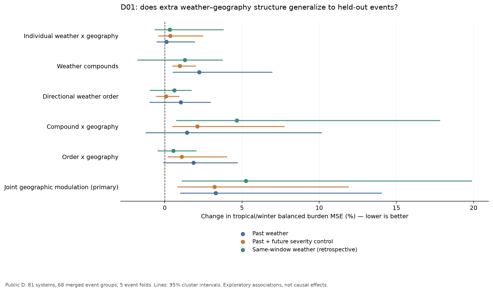

# D01：天气顺序、叠加与地理的第一轮数据检验

## 结论

**这轮尚未证实可泛化的“天气叠加/顺序 × 地理”增量，不能据此选定更大的地理核。**
三种规格的联合地理调制都使热带/冬季负担 MSE 增加，五个留出折均未改善。
这否定的是本轮固定的县级摘要与正则回归探针所提供的证据，**不是证明真实物理关系不存在**。
简单持续值参考还揭示了探针本身的泛化限制，不能只报告交互项的相对变化。

本轮是 PI 授权的数据分析；没有实现 I19、重训 AsymODE/GCRK、增加神经模型 seed，
也没有接触 sealed C 或修改论文。I18 已另行收尾，监控已暂停。

## 范围与可重复性

- 输入仅为既有公共 D：8,457 县事件、81 系统、80 family、2,410 县。
- 原有 event split 合并相关家族及相近日期的共享县系统；本分析实际使用 **68 个合并事件组**
  计算区间。按各组设计权重最大的天气类分层，组数为热带 14、冬季 13、大风 9、对流 15、强降雨 17。
  不能把 50,302 个窗口当作 50,302 次独立风暴。
- 预先固定 72/96/120/144/168/192 六个起点。每个历史与响应窗口各 24 小时，
  当前停电必须已观测，两窗口各至少 22 小时有效；50,742 个候选窗口保留 **50,302**，
  所有县事件均保留。每县事件权重按保留窗口数分摊，缺测不当零。
- 主响应为随后 24 小时平均停电比例；次响应为随后峰值相对起点净增加至少 1 个百分点。
  后者是 stock 上升指示，不是已识别的新增设备故障。
- 12 个原始天气变量用于主效应。交互覆盖阵风、降水、温度、土壤湿度、降雪、CAPE 的 15 个天气对，
  与海拔、起伏、林冠、开发比例、排水不良比例、林地湿土共位六种地理描述相交。
  全部 40 个地理主效应保留。降水、雪水当量、CAPE 先作固定 log1p 变换。
- 先控制强度、各自滞后历史、季节、粗空间背景、县静态与既有停电，再加入持续高值叠加、
  同时共变、对称滞后、反对称顺序；最后分别加入叠加与顺序的地理调制。
  “低温与降水”不能被称为直接观测到的冻雨。
- 所有填补、缩放和正则参数选择均在对应内层训练分区完成。六个嵌套模型及三个地理替代对照，
  三种规格、五折均完成；各预测有限、有界、每行恰好留出一次，三规格目标及样本完全一致。

设计与分析实现于拟合前提交 `7d7fd94`。7 项独立测试覆盖时间矩性质、留出校准隔离、
县级 donor 稳定性，以及缓存加权 Ridge 与独立 sklearn 实现的一致性。
代码和协议 hash 在三份评分中一致。完整拟合约 520 秒，nice 15，单进程，BLAS 线程环境上限设为 2；
期间未干预其他会话进程。原始预测保存在忽略的 `runs/geo_weather_20260924/data_first_d01/`。

## 主比较：联合地理调制是否带来增量

F/D 在已有天气叠加、天气顺序及普通天气×地理项之上，同时加入叠加×地理与顺序×地理。
以下是**相对 MSE 变化百分数**，负值更好；每类先计算比值，再等权平均。
区间为 2,000 次合并事件组 bootstrap，固定 OOF 预测，不包括重新拟合的不确定性。
这是开发性分析，不是多重比较校正后的确认性结论。

| 规格 | 热带/冬季（95% 区间） | 全五类（95% 区间） | 改善折数 |
|---|---:|---:|---:|
| 过去一天的天气 → 随后一天负担 | +3.292% [+0.985,+14.052] | +4.883% [+2.452,+10.068] | 0/5 |
| 再控制随后一天的无序天气强度 | +3.227% [+0.796,+11.906] | +6.632% [+3.411,+11.202] | 0/5 |
| 同窗天气与停电，控制窗前状态 | +5.249% [+1.086,+19.898] | +4.689% [−0.293,+12.910] | 0/5 |

第二、三行使用事后天气观测，只是机制敏感性分析，不是业务预报能力。
第一行也使用再分析资料；“过去”只指时间索引，不保证资料在业务起点实时可得。
所有规格是滚动起点任务，不能把这些数字直接与 I18 固定起点的误差变化比较。

未截断权重下的主变化分别为 +3.265%、+3.273%、+5.338%。
单独按县聚类的 95% 区间分别为 [+2.034,+5.356]%、[+1.908,+5.206]%、[+3.238,+8.027]%；
它们是重复县依赖的敏感性，不是双向聚类或新地区泛化证明。
去掉对主比较贡献最大改善的系统后，主变化分别仍为 +3.632%、+3.818%、+7.085%。

| 天气类：F/D | 过去天气 | 控制未来强度 | 同窗天气 |
|---|---:|---:|---:|
| 热带 | +1.798% | +1.658% | +4.190% |
| 冬季 | +4.787% | +4.797% | +6.309% |
| 天气尺度大风 | +5.586% | +2.632% | +7.626% |
| 对流 | +9.232% | +16.094% | +4.268% |
| 强降雨 | +3.012% | +7.978% | +1.054% |

## 把顺序、叠加和地理分开看

下表仍为热带/冬季负担 MSE 的相对变化，括号为 95% 合并事件区间。

| 新加入的信息 | 过去天气 | 控制未来强度 | 同窗天气 |
|---|---:|---:|---:|
| B/A：普通单天气×地理 | +0.106 [−0.537,+1.954]% | +0.351 [−0.435,+2.472]% | +0.317 [−0.660,+3.816]% |
| C/B：持续高值、共变与对称滞后叠加 | +2.228 [+0.505,+6.961]% | +0.973 [+0.473,+2.012]% | +1.294 [−1.777,+3.749]% |
| D/C：方向顺序，控制相同 lag 的对称项 | +1.040 [−0.997,+2.978]% | +0.079 [−0.580,+0.949]% | +0.620 [−0.982,+1.728]% |
| E/D：叠加×地理 | +1.446 [−1.242,+10.168]% | +2.113 [+0.480,+7.749]% | +4.669 [+0.727,+17.826]% |
| F/E：顺序×地理 | +1.853 [−0.113,+4.733]% | +1.091 [+0.189,+4.027]% | +0.551 [−0.466,+2.047]% |

这些对照没有产生通过预设候选标准的负担增量。比如控制后续天气强度后，单独顺序项
约为 +0.08%，区间跨零；不能把某个天气对的系数符号直接解释成“先雨后风更危险”。
我们没有事后从 15 对里选效果最好的一对重设本轮结论。

次要上升风险指标存在很小的改善点估计，但没有改变主判断：同窗叠加 C/B 为
−0.576% [−1.820,+0.614]%，同窗联合地理 F/D 为 −0.081% [−1.117,+0.728]%；
区间均跨零。不能以次要端点替代负担主端点。

## 地理对应控制与简单参考

三个同维度控制只替换 D 之上新增交互中的地理向量，较低阶真特征不变；
同一县跨事件保持同一 donor，donor 来自训练县并优先同州。
每折均仅 1/2,410 个收件县没有其他可用同州 donor，采用预设跨州退路；
所记录的训练分区最大边际均值偏移约 0.104 个真实地理标准差。
这不保证天气—地理联合支持域匹配，不能视为精确条件随机化检验。

F 相对三个替代地理对照的主 MSE 变化：

| 规格 | donor 1 | donor 2 | donor 3 |
|---|---:|---:|---:|
| 过去天气 | +2.833% | +2.160% | +3.129% |
| 控制未来强度 | +2.977% | +1.911% | +2.562% |
| 同窗天气 | +0.711% | +2.188% | −0.634% |

前两行六个区间均高于零；第三行三个区间均跨零。因此不能说三个规格都比所有
替代对照差，但没有一个规格显示稳定的真地理优势。这些控制验证联合调制，
不能替代保留 E 后仅破坏顺序对应的专用控制。没有用任意逐小时 shuffle 冒充顺序证据。

**重要的探针限制：简单持续值参考。** 以下是额外的描述性核查，在第一组结果后添加，
没有重新拟合或改动任何判定；持续值预测为整个下一窗口保持起点停电比例。

| 规格 | 加性参考 A 相对持续值（95% 区间） | 全交互 F 相对持续值（95% 区间） |
|---|---:|---:|
| 过去天气 | +4.12% [−11.04,+41.13] | +11.33% [−5.04,+73.71] |
| 控制未来强度 | +0.69% [−14.10,+37.90] | +5.24% [−9.48,+57.87] |
| 同窗天气 | −2.41% [−17.73,+35.24] | +4.83% [−12.80,+56.44] |

A/F 在大风、对流、强降雨三类均未胜过全零参考。当前状态的持续性很强，
而这些回归探针并未稳定建立比简单参考更强的天气响应基线。
六个持续值对照区间均跨零；也不能反过来宣称探针相对持续值存在普遍的统计显著劣势。
因此负结果还可能来自统计表达、惩罚、损失、支持域和有限事件样本，不能升级成物理否定。
参考预测的完整分项及区间见 `data_first_d01_reference_checks.json`。

## 对下一步设计的约束

**PI 后续修正（本轮完成后）：** 不把下述少数组合建议作为探索范围的收窄。
D01 只评估统一表达下的平均增量，不能据此压低县结构异质性的优先级。
下一轮 D02 将广泛检视不同县群的方向、阈值、时滞及事件组成，寻找平均值可能掩盖的症状；
具体范围见 `D02_COUNTY_COMPLEXITY_SCOPE_20260928.md`。D01 原始结果与统计定义保持不变。

1. 本轮不支持仅通过增加县级地理乘积、方向项或更大的条件头来选择下一版架构；I19 继续暂缓。
2. 仍需区分“所选摘要提取失败”和“数据分辨率/样本中没有可识别信息”。
   先把候选收窄到可解释的天气组合，例如降水→风与风→降水、湿土后遇风，
   做同场风暴、相近强度/持续时间/初始状态下的匹配与支持域核查。
   这些是后续问题，不是本轮已确证机制。
3. 县级平均无法直接检验县内暴露共位。已有 D 节点地理与同源 ERA5 档案提供了可审计基础，
   但需要先查同县节点是否具有足够不同的天气暴露，再讨论非线性后聚合结构。
   当前结果不能证明县均值聚合就是根因，也不能保证节点模型有效。
4. 即便后续出现稳定关联，观察性数据、粗空间控制、重复县及 ERA5 业务可用性仍限制因果和部署主张。
   事件留出支持新事件泛化，不自动支持新县或新地区泛化。

## 文件

- 事前冻结范围：`notes/D01_DATA_FIRST_PROTOCOL_20260928.md`。
- 三份完整评分：`results/v1/data_first_d01_{past_only,future_adjusted,aligned_exposure}.json`。
- 紧凑对照：`results/v1/data_first_d01_summary.json`；图：`results/v1/fig_data_first_d01.png`。
- 独立核对：`results/v1/data_first_d01_export_validation.json`、`data_first_d01_review.json`、
  `data_first_d01_reference_checks.json`。未重训、未重新推断神经模型。

