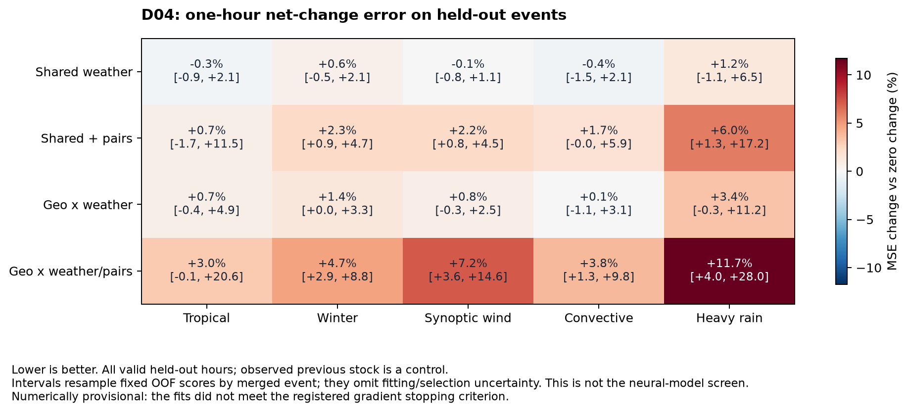
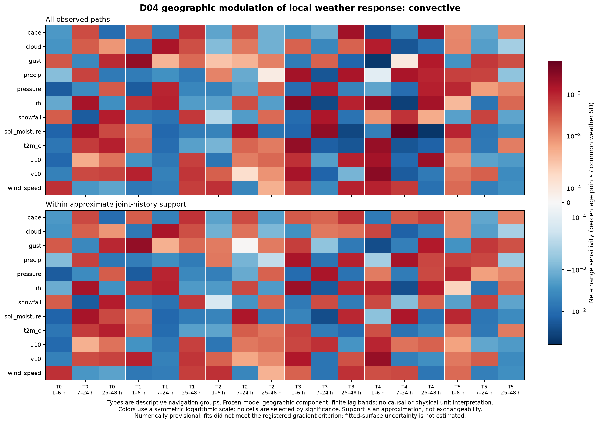

# D04：天气—地理条件响应分析结果

2026-09-28（ET）。已完成五折的 100 次统计拟合、16 次历史控制敏感性拟合，以及留出评分、峰值、局部响应、组合分解和支持审查。训练前登记提交为 `37dc96b`；[固定范围](D04_CONDITIONAL_IMPACT_RESPONSE_SCOPE_20260928.md)和训练源文件保持原样。仅公共 D；I18 监控仍暂停。

## 结论与研究主线

研究主线保持为 **天气过程 → 地理的复杂调制 → 冲击形成、叠加与累积 → 停电**。

这一轮没有得到可以冻结下一版地理核的强响应证据。当前统计探针存在三个实质问题：地理和天气组合项未改善事件外误差；模型对大幅上升响应明显不足，同时制造假峰；全部拟合均未达到登记的梯度收敛阈值。因此不应把这些拟合曲面直接命名为地理机制，也不能据此否定复杂天气—地理作用。

仍保留全部天气、县结构、正负方向和弱支持格。局部响应中存在方向、时滞和幅度差异，但事件构成、相关天气、数值误差及分量之间的重新分配均可解释部分差异。总体 MSE 不作为删除这些线索的门槛。

## 1. 实际执行与观测对象

覆盖 8,457 个县事件、2,410 县、81 个系统、80 个 family、68 个合并事件组。保留 1,503 个 `used=False` 县事件，以及零停电和负变化。固定六小时采样相位的 202,311 个一小时差值用于拟合；所有 1,213,761 个有效小时用于事件外评价，每行恰好一次，四模型预测均有限。4,047 个候选差值因相邻小时缺测而排除，不跨缺口插值。六相位指 (t−72)%6 的相对偏移，不是 UTC 时钟分组。每县事件权重按其实际有效小时分摊；六相位汇总各自恢复县事件总权重，其他结果分层沿用全小时权重的条件切片，不能简单平均六相位分数还原总体分数。

这里的 p(t) 是既有面板中**可用 15 分钟客户停电比例的小时均值**，分母为既有 2024 modeled customer 数，不是人口占比或小时末库存。小时内可能不足四个观测，面板未保留该覆盖量。响应 y(t)=p(t)−p(t−1) 是净变化，不能分别识别新故障和恢复；差分也可能放大报告噪声。未剪裁原始响应或删除极值。

天气只取 t−1 至 t−48，分 1–6、7–24、25–48 小时三带。每个天气通道都有非线性主项，另有同步、跨带对称和跨带有向项，共 774 个坐标；连续 geo40 构成 144 维地理基，context6 单独控制。所有模型共享完整加性地理基、背景、县截距收缩和历史状态控制，并有 context×weather 交互。四个结构为：

| 模型 | 天气表示 | 地理调制 |
|---|---|---|
| A | 144 个非线性主项 | 无 |
| B | 774 个主项及组合项 | 无 |
| C | 同 A | 低秩地理×天气 |
| D | 同 B | 低秩地理×天气及组合 |

这是使用观测 p(t−1) 的条件一步诊断。不能把预测差值累加后称为自由运行的停电轨迹；ERA5 为再分析天气，也不是业务天气预报实验。三带二阶表示没有保留带内完整顺序、所有逐小时滞后组合、高阶作用或超过 48 小时的历史。

## 2. 数值状态必须先于机制解释

| 阶段 | 拟合数 | 用满迭代预算 | 提前停止 | 梯度达标 | 有限且训练目标下降 |
|---|---:|---:|---:|---:|---:|
| 内层选择 | 60 | 60 | 0 | 0 | 60 |
| 外层两起点 | 40 | 24 | 16 | 0 | 40 |
| 全 D 历史控制对照 | 16 | 10 | 6 | 0 | 16 |

内层预算 60 步，外层及历史对照 120 步。停止梯度标准是最大绝对梯度 ≤1e−5；外层实际范围为 7.09e−5 至 6.99e−3。提前停止不能写成已收敛。D 的十个外层起点全部用满预算，两起点惩罚训练目标差为 0.000230–0.002097，大于其他结构。第二起点仅保留诊断而未保存完整参数，所以小目标差也不能证明曲面或符号对初始化稳定。

各折均选择 ridge=0.1；C 的地理秩依次为 2、2、4、4、2，D 均为 2。这是有限预算、有限候选中的训练内选择，不能用于宣称响应的真实秩为 2。重构系数算子的奇异值位于标准化且相关的基坐标中，不是物理机制数或响应方差占比。

## 3. 留出评分：现有探针没有净改善

下表为相对“下一小时净变化为零”的误差变化（%，负值更好）。balanced 指先对各天气类原始 MSE 等权平均，再计算两个模型的比值，不是各类相对变化百分比的平均。括号为固定留出预测上的 95% 合并事件重采样区间，不包含拟合、选择或优化随机性。

| 模型 | 热带/冬季 balanced MSE | 五类 balanced MSE | pooled RMSE |
|---|---:|---:|---:|
| A | −0.064 [−0.625, +1.418] | −0.013 [−0.496, +0.888] | −0.030 [−0.455, +0.598] |
| B | +1.068 [−0.908, +7.318] | +1.674 [+0.100, +5.217] | +1.099 [+0.450, +2.129] |
| C | +0.837 [−0.051, +3.236] | +0.922 [+0.178, +2.312] | +0.335 [−0.172, +1.103] |
| D | +3.466 [+0.828, +12.714] | +4.790 [+2.457, +10.646] | +2.435 [+1.459, +3.937] |

地理调制的配对比较：C/A 五类 MSE **+0.935% [+0.419,+1.638]**；D/B **+3.065% [+1.846,+5.313]**。增加组合历史的 B/A 为 +1.688% [+0.445,+4.519]，D/C 为 +3.834% [+1.962,+8.349]。采用原始未截顶权重时，两个地理对比分别为 +0.907% 和 +3.021%。这些均是当前统计探针的结果，与 I18 神经模型的 stock 指标不直接比较。

完整五天气、县重采样、原始权重、时钟相位、分折、未见县和裁剪后一步 stock 诊断见 [评分 JSON](../results/v1/d04_response_scores.json)。未见县共有 95,001 个评价小时；县是否见过按各自外层训练集确定。并未只保留训练中出现过的县。

## 4. 总分以外，更有意义的是上升与回落的不对称

全部有效小时中，790,564 个净变化为零，197,903 个为正，225,294 个为负。按照同一设计权重，在观测正变化子集，A/B/C/D 相对零变化的 MSE 分别增加 **3.334/4.136/3.689/5.512%**；在负变化子集则降低 **8.844/8.648/8.707/8.168%**。

8,300 个至少 +1pp 的小时，其加权真实平均增量为 **+3.459pp**，四模型平均预测却为 **−0.071/−0.077/−0.077/−0.087pp**。这是按观测结果分层的诊断，不是单独的前瞻样本，更不是新故障率估计。它表明这套条件均值探针对上升冲击刻画不足，平均总分会混合不同方向的表现；不能从负变化拟合较好直接识别物理恢复机制。

局部有利结果也保留：9,364 个 ≤−1pp 的小时上，D/B 的 pooled MSE 为 **−0.700%**（原始权重 −0.984%），D/零变化为 −10.529%。但 D 的平均预测仅 −0.292pp，真实均值为 −3.134pp；该分层没有评分区间，也未估计拟合不确定性。未见县子组中 D/零变化为 −0.542%，D/B 仍为 +0.807%；它不是区域外验证。零变化子组的基准 MSE 为零，相对百分比未定义，保留绝对误差。

最大正净增量 ≥1pp 的 2,963 个县事件中：

| 模型 | 预测/真实峰比中位数：无权 / 设计权 | 达到真实峰一半：无权 / 设计权 |
|---|---:|---:|
| A | 4.01% / 2.56% | 1.08% / 0.050% |
| B | 7.04% / 4.82% | 5.40% / 0.919% |
| C | 4.22% / 2.93% | 2.23% / 0.163% |
| D | 8.14% / 5.23% | 7.49% / 1.807% |

与此同时，在 270 个没有观测正增量的县事件中，预测出 >0.1pp 正增量峰的无权比例为 **46.30/74.81/55.19/85.19%**，设计权比例为 **21.23/50.05/27.09/51.86%**。174 个全窗已观测 stock 均为零的县事件也完整保留。因此“预测最大值变大”不能直接当作捕捉冲击的改进。

D 的峰时差无权中位数为 0 小时，但 p10–p90 为 −69 至 +76 小时；在真实峰时刻的预测/真实增量比中位数仍为负（−0.381%，设计权 −0.904%）。独立寻找两个最大值会遮蔽对时不足。时间差仅对观测与预测峰均为正的单位计算；边界、并列、平台和邻接缺测均保留并标记。大增量组真实边界峰 25 个、并列及连续平台各 33 个、峰邻接缺测 5 个。完整结果见 [峰值 JSON](../results/v1/d04_increment_peaks.json)。这些案例和 I18 的 stock 峰值阈值不同。

## 5. 连续地理、县结构与天气顺序：保留了什么线索

局部灵敏度以统一 D03 变换后天气标准差为单位，固定历史控制和其他坐标，对一整个滞后带均匀作微小变化。它是模型导数，单独改变 gust、u/v 或 wind speed 可能不符合真实天气依赖，因此不解释为可实施干预。

202,311 个相位零留出行中，190,285 行位于训练侧联合天气/历史/context 距离的近邻阈值内，12,026 行在外，未知为零。该阈值只是有限表示和有限地标的支持代理；**不能据此宣称县类型之间已匹配到相同天气分布，或具有因果共同支持**。类型的平均导数仍在各自实际天气路径上求平均，混合地理、天气组成和事件差异。

例如，在代理范围内的对流事件，1–6 小时 gust 的地理分量平均灵敏度在 T1 为 **+0.0242pp/SD**，T4 为 **−0.0268pp/SD**；T1/T4 分别覆盖 10/9 个合并事件，但按事件权重计算的 Kish 数仅约 **2.04/4.41**。这些正负并存的格保留为线索，不能写成已证实的“某地形放大风害、另一地形保护”。模型输入保留连续 geo40，六类只是导航组；所有 12 通道、三个时带、五类天气、县间平均响应分布及分折均值均在 [响应图谱 JSON](../results/v1/d04_response_surfaces.json) 中保留。县均值分位数和事件极值是分布范围，不是曲面置信区间。

对 D 的完整天气响应导数，在支持代理内，36/36 个通道×时带的县均值 q10–q90 跨零，32/36 的县型均值跨零；但没有显式地理交互的 A 也分别有 23/36 和 11/36 跨零。可见县型差异本身并不能识别地理调制。支持内的 68 个事件整体 Kish 数为 11.42，最大事件权重占 19.4%；T3 更集中，Kish 约 2.20、最大事件占 66.6%。不能用窗口数或彩色格数代替独立事件证据。

冻结 D 模型在相位零留出行上的地理分量，按主项、同步、跨带对称、有向顺序拆分，其 pooled RMS 依次为 **0.0418、0.0755、0.0685、0.0562pp**，合计分量 RMS 为 **0.0848pp**。模型确实使用了组合项，不能说“顺序分支没有激活”。但各块相关，RMS 不能相加；这个分解既不是独立效应，也没有证明顺序提供了净信息。分块和对原始模型分量的最大重构误差为 5.54e−8 fraction。完整各天气/县类型分解见 [组合分量 JSON](../results/v1/d04_components.json)。

## 6. 移除历史控制并未释放出更大的整体地理信号

使用五折所选配置的众数，在全 D 上分别保留/移除 p(t−1)、其平方和平方根、p(71) 四项，其他表示、县收缩和背景控制相同。每种结构两个起点，按训练目标选择。两版都是描述性全 D 拟合，无新增 OOF 或独立验证含义。

D 的地理分量 pooled RMS 为 **0.06670pp（保留）/0.06693pp（移除）**；对 36 个通道×时带坐标的平方导数等权平均后开方，得到总体 RMS **0.03795/0.03825pp/SD**，不是各坐标 RMS 的算术平均。两版导数差按同一定义计算的 RMS 为 0.00770pp/SD，说明局部结构会变，但整体量级并未明显释放。这里的 all 使用原设计 pooled 权重，不是训练时五天气平衡目标。

这不支持把当前弱证据全部归因于历史状态“控制过头”，也不证明历史控制无影响；两版均未达到梯度准则，相关分量会重新分配。见 [历史控制 JSON](../results/v1/d04_history_sensitivity.json)。

## 7. 对下一版 kernel 的具体约束

1. **先把统计求解和观测时间对齐核实，再用响应符号定结构。** 后续应另行登记精度、停止规则和初始化稳定性审计，保存两个起点的重构算子；不在本轮结果上偷偷增加迭代或改目标。还需核查小时均值与天气时间戳、净增量极值和小时内报告覆盖，保留原始样本及敏感性，不能先把大跳变当作真实损伤。
2. **保持冲击上升与库存回落的分工。** D04 的正负不对称是对当前条件均值探针的直接诊断，要求下一模型同时检查上升峰、对时、平静期假峰和回落。候选核仍置于唯一损伤 MLP 的隐藏天气表示中；现有宿主承担 stock/恢复观测联系，不把净变化直接命名为损伤强度。
3. **连续地理改变天气到潜在冲击的读入、记忆及组合方式。** 保留地理条件读入、多时间尺度、同步与有向历史状态这一候选方向；不根据当前 T1/T4 的导数符号硬编码规则，也不把 774 坐标、rank2 或六类导航组直接复制成网络结构。现 GCRK 已能表达记忆和非交换顺序，后续改动必须说明新增约束或可检验分工。
4. **强 motivation 仍需稳定条件响应支持。** D03 已支持保留地理方向和天气时间形状；D04 进一步揭示正负响应混合、峰与假峰的取舍、事件集中及求解限制。它尚未证实地理条件下的某个天气次序/叠加机制。共同路径分布上的县响应比较、自然天气方向对比及拟合不确定性仍待后续独立设计，不用本轮近邻代理替代。

有限队列现已结束，所有输出保留。没有自动启动下一神经核、扩 seed、NULL、或额外数值重拟合；封存 C 与 `paper_v1/` 未读取/修改。源/产物哈希、掩码、恰好一次覆盖、有限值、分块重构和评分算术均完成审查；数值未达梯度标准作为主要限制保留在图和报告中。
