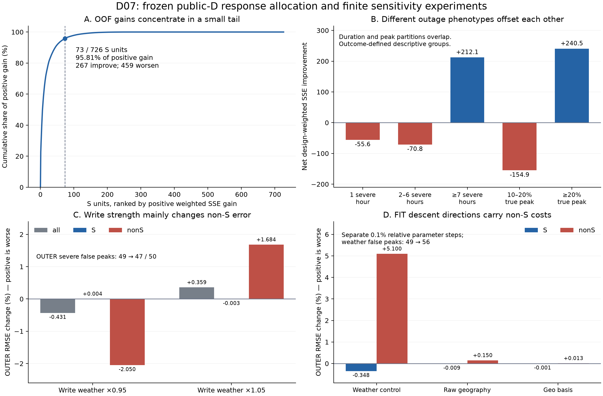

# D07：真实 D 数据中的响应分配与八个有限干预

日期：2026-09-29。范围登记：`8f8ddef`，见 [D07 scope](D07_RESPONSE_SELECTIVITY_SCOPE_20260929.md)。本轮已经完成，没有新训练队列。

**现在有实证支持的诊断是：当前 CRK 的收益分配高度不均，持续大停电和短时尖峰互相抵消；控制层的局部改善方向还会把响应引向非严重病例。** 写入方向经常近乎固定，但假峰工作点并非统一“更饱和、梯度更小”。因此，单纯加大核、整体降低写入或放大组合地理支路，都没有获得本轮证据支持。

这定位的是一个已训练实现的症状。它没有证明真实停电的地理机制，也没有否定“天气→地理复杂调制→冲击→停电”的研究假设。

## 1. 本轮具体做了什么

- 全部 8,457 县—事件、五个原事件折，配对冻结宿主与 CRK 的 OOF 预测。保留 S（预测窗观测真峰≥10%）、J、non-S、全 D、五类天气、五折和全部 68 个合并事件组。
- 固定第一折全部 6,350 FIT / 2,107 OUTER，复现两套模型与同一 CRK 的关闭出口预测；在真实峰、两臂各自预测峰和固定时钟检查写入、状态、控制 Jacobian。
- 两个写入干预：仅把天气驱动的写入 preactivation 差乘 **0.95、1.05**。保留原参数、旋转、保留率、模式增益、读出和宿主。
- 六个参数干预：天气控制、原始地理映射列、组合地理映射列，分别沿完整 FIT 梯度下降方向施加 **0.1%、1% 相对参数范数**的独立扰动。每次恢复同一冻结状态，没有 Adam、累积更新或新检查点。
- 原 FIT 目标的 **61 个原系统×S/non-S，112 个非空分区**梯度。分区用原系统标识；合并事件组单独记录，不能混称。

这些是固定 seed0 / step900 上的探索性定位。干预不代表真实天气变化，也不代表公平重训后的预测成绩。S 和真实峰时使用未来观测，只能用于诊断，不能成为预测时路由输入。

## 2. 配对数据纠正了“训练内已经普遍学会峰值”的说法

逐单位计算严格恒等式：

\[
r=y-P_{\rm base},\quad\Delta=P_{\rm CRK}-P_{\rm base},\qquad
\mathrm{SSE}_{\rm base}-\mathrm{SSE}_{\rm CRK}
=\sum_{i,t} w_i m_{it}(2r_{it}\Delta_{it}-\Delta_{it}^{2}).
\]

`2rΔ` 是修正与原误差的对齐项，`Δ²` 是修正自身的幅度代价。对独立宿主的比较包含共同重训后的全部差异；同一 CRK 的 open/closed 另列，不能混称为地理因果贡献。

| 严重病例集合 | 轨迹获益/总数 | 获益单位设计权份额 | 正收益最集中的前约10%单位 | S RMSE 改善 |
|---|---:|---:|---:|---:|
| 第一折 FIT | 409 / 559 | 46.87% | 56 个贡献 83.27% 正收益 | +44.03% |
| 第一折 OUTER | 73 / 167 | 30.08% | 17 个贡献 88.51% 正收益 | −0.455% |
| 五折 OOF | 267 / 726 | 19.98% | 73 个贡献 95.81% 正收益 | +0.365% |

“获益”是单位轨迹平方误差严格下降，未设最小临床/工程幅度；正收益集中度分母是所有正收益之和，不是净收益。FIT 有 409 个单位获益，**不能概括为只拟合了少数县**；但收益量级集中、设计权覆盖不到一半，且 52 个轨迹获益单位的峰幅误差反而增加。FIT 设计权峰幅比中位数仍从 **1.2308% 降至 0.7999%**。这里的百分数是预测峰/真峰，不是预测停电比例。

五折 S 的对齐项 **616.6974**、修改代价 **531.0239**，仅剩净收益 **85.6735**。正收益 **456.1274** 被负收益 **370.4539** 大幅抵消；459/726 单位恶化，覆盖 80.02% 设计权。OOF 中 76 个轨迹获益单位的峰幅误差也变大。不同指标确实在回答不同问题。

原共同观测支持上的 S 改善 **+0.3652%**，1,999 次合并事件组 bootstrap 95% 区间 **[−1.0240%, +1.2985%]**。限制为全 144 小时都有观测的 702 个 S 单位后，改善仅 **+0.0096% [−1.2580%, +0.8172%]**。这是缺测敏感性，不能用完整样本替换原登记口径。

同一 CRK 出口的五折比较也只有 S **+0.4470% [−0.8434%, +1.5744%]**，并伴随 non-S 恶化；问题不只是独立宿主参考不同。完整配对表见 [A 汇总](../results/v1/d07_attribution.json.gz)。

## 3. Overall 稀释的是什么：持续大停电与短时尖峰

在查看 D07 结果前固定了以下自然分层：观测停电≥10%的小时数 1、2–6、≥7；观测真峰 10–20%、≥20%。本轮是在已有 D05/D06 之后进行，分层仍是探索性的，不是独立预注册确认。以下区间为冻结模型条件下的逐项区间，未经多重比较校正。

| 五折 S 的观测形态 | 单位数 | RMSE 改善；95%区间 | 净设计加权 SSE 收益 |
|---|---:|---:|---:|
| 仅 1 小时≥10% | 122 | **−12.75% [−29.70%, −0.88%]** | −55.58 |
| 2–6 小时≥10% | 213 | **−2.34% [−7.60%, −0.58%]** | −70.83 |
| ≥7 小时≥10% | 391 | +1.06% [−0.19%, +2.20%] | +212.08 |
| 真峰 10–20% | 358 | −6.12% [−14.33%, −2.02%] | −154.85 |
| 真峰≥20% | 368 | +1.15% [+0.045%, +2.26%] | +240.53 |

持续时间分层与峰值分层彼此重叠，不能把表中五行相加。联合的“≥7 小时且峰≥20%”298 个单位贡献 **+250.39** 净 SSE 收益，其他五个联合格合计 **−164.72**。这不是已经识别的天气或地理亚型，也不能用未来真峰定义部署路由；它首先证明**同一个总体成绩掩盖了不同响应形态的损害与收益**。

冻结终点的 FIT 上差异更强：持续≥7 小时的 S 改善约 **54.72%**，仅 1 小时的 S 改善约 **2.11%**。因此下一版需要同时解释峰幅、起涨和持续过程，不能把一个 FIT RMSE 降幅当作所有严重病例响应都已解决。

## 4. 真实峰与假峰时，控制层究竟在做什么

当前写入：

\[
d=\frac{\tanh R(g,u)-\tanh A(g)}{2\sqrt8}.
\]

第一折 OUTER 的 S 真峰时，四模式写入范数的设计权中位数为 **0.9923–0.9966**，反锚点余弦中位数 **0.999982–0.999998**；“范数≥0.9且反锚点余弦≥0.95”的联合设计权比例为 **94.87%–98.96%**。相邻写入方向余弦中位数 **0.9999845–0.9999995**。

全部有效相邻小时中，FIT 911,871 对、OUTER 301,890 对，四个模式的整模式方向翻转（余弦<0）均为零。隐输入确实在变：S 真峰时相邻 64 维输入距离中位数 **1.8051**，实际写入变化/输入距离中位数 **0.01335**。因此支持“常见工作区方向变化很小”，**不支持写入完全恒定或对所有天气方向无反应**。旋转、保留和读出仍可随天气变化。

近满幅写入朝反饱和锚点是坐标盒的结构性质；不能把这个几何必然性单独当作致错机制证据。

假峰必须在模型的预测峰时看。固定第一折 OUTER 49 个 non-S 假峰，在 CRK 自身预测峰时：

| 工作点；全部 OUTER | S 自身预测峰 | non-S 自身预测峰 | non-S 假峰的预测峰 |
|---|---:|---:|---:|
| 局部写入 Jacobian Frobenius 中位数 | 0.09981 | 0.06227 | **0.46507** |
| 实际相邻输入方向导数范数中位数 | 0.003256 | 0.005662 | **0.069642** |

假峰组的锁定比例仅约 **79.70%–89.08%**，比广泛背景低。固定时钟下也有较高 Jacobian：假峰组 **0.25590**、S **0.08196**、non-S **0.07413**。所以“假峰是由于更加饱和、没有梯度”这一简单解释应降级。结果与“大片缓变区和局部敏感边界并存”相容，但还不是边界造成假峰的因果归因；病例组和峰时也是模型/结果选择的。

Jacobian 是 **64 维标定 hidden level/departure→32 维写入**，不是原始天气到停电的全链导数。解析式经过 autograd 和合成有限差分验证。见 [B 完整汇总](../results/v1/d07_controllers.json.gz)。

## 5. 两个写入实验：统一强弱调节不能兼顾两类病例

下表相对同一冻结 CRK，**RMSE 变化正数为恶化**；没有重训。

| 写入天气差倍率 | FIT S RMSE变化 | OUTER S RMSE变化 | OUTER non-S RMSE变化 | OUTER假峰 |
|---|---:|---:|---:|---:|
| 0.95 | +0.4181% | +0.0039% | **−2.0500%** | 49→47 |
| 1.05 | −0.2077% | −0.0033% | **+1.6837%** | 49→50 |

降低写入主要缓解 non-S，并没有实质恢复 S；提高写入增加非严重病例的代价。0.95 的 OUTER 假峰设计权率从 **0.2899% 降至 0.1973%**，删除两个单位，所以单位数变化和设计权变化不能混用。

这两个固定点足以反对“只把当前写入整体加大就能获得显著严重病例收益”的推进方式，但不能排除重新设计/训练工作区后获益。本轮没有补搜其他倍率。

## 6. 原 FIT 梯度：严重病例没有被目标忽略，但更新方向相互冲突

分区用统一完整 FIT 分母和原训练的 float32 `w/Z_regime` 权重；不能每个事件重新归一化。112 个分区相加恢复单独完整 FIT 的梯度，最大绝对差 **5.12×10⁻¹¹**、相对 L2 差 **3.90×10⁻⁶**。

S 占当前 FIT 目标 **82.66%**；S/non-S 完整参数梯度余弦 **−0.4760**。代表块：天气控制 **−0.4874**、组合地理映射 **−0.6912**、读出出口 **−0.9156**；原始地理映射为 **+0.1887**，并非所有块都冲突。

这证明冻结终点存在有效、相互不一致的更新方向。它不能代表 900 步训练历史，也不能直接算出整个训练收益受冲突影响多少。梯度范数还受参数尺度、坐标化和维数影响，不能把小范数等同于信息缺失。

六个固定局部参数实验结果如下；各变化列为相对同一 CRK 的**设计加权 RMSE 百分比变化**，正数为恶化。它们不等于类别归一化原目标变化：

| 参数块；相对扰动 | FIT S变化 | OUTER S变化 | OUTER non-S变化 | OUTER假峰 |
|---|---:|---:|---:|---:|
| 天气控制；0.1% | −0.8299% | **−0.3480%** | **+5.1005%** | **49→56** |
| 天气控制；1% | +33.7660% | +0.8755% | +76.9877% | **49→198** |
| 原地理映射；0.1% | −0.1141% | −0.0087% | +0.1498% | 49→49 |
| 原地理映射；1% | +0.0192% | −0.0889% | +1.7072% | 49→49 |
| 组合地理映射；0.1% | −0.0040% | −0.0007% | +0.0132% | 49→49 |
| 组合地理映射；1% | −0.0399% | −0.0075% | +0.1320% | 49→49 |

**六个 OUTER 全集合原目标变化均为恶化，但五个 OUTER S 原目标变化为改善。** 不能把全集合结论扩大到所有亚组。0.1% 天气控制扰动降低 FIT 全目标，却提高 OUTER 全目标；1% 已跨出有效下降区，连 FIT 全目标都恶化。它说明当前控制映射对参数变化有敏感工作区，不能理解为多训练一步一定如此，更不能按 OUTER 挑选这六个点。

组合映射在这些扰动下有非零变化，但量级小，且仍有 non-S 代价。**它不支持把支路直接放大，也不识别组合地理的净信息。** 见 [C 完整汇总](../results/v1/d07_gradients.json.gz)。

## 7. 对下一版 kernel 的数据动机与约束

已有数据证据应与 D07 模型诊断分开：

1. [D05](D05_LARGE_OUTAGE_FORENSICS_RESULTS_20260928.md) 的同县同事件天气对比显示热带大起涨前一小时 gust +1.745z、precipitation +2.511z；冬季严重峰前 −24…−7h、−6…−1h snowfall 对比分别约 +1.507z、+2.189z。它们支持继续研究历史与不同响应过程，属于结果选定锚点、多个坐标的观察性对比。
2. D05 的结果独立风险时钟匹配覆盖约98.16%设计权；同事件、同绝对小时、过去天气和背景相近时，存在 canopy 等地理关联候选。但量级小、对照未平衡完整联合天气顺序或基础设施、许多比较未经多重校正，不能写成已证实的联合作用机制。
3. [D03](D03_HIGH_DIM_STRUCTURE_RESULTS_20260928.md) 的均值仅保留约68.96%天气路径变化，八个固定DCT系数/通道保留约97.66%；地理40维达到90%方差需要11个PC。该审计未读取停电值，说明表示有结构，不能证明响应必须高维。
4. [D04](D04_CONDITIONAL_IMPACT_RESPONSE_RESULTS_20260928.md) 已有地理调制探针的事件留出表现不利；I20 的10%目标也失败。现有证据尚不支持稳定可迁移的地理净收益。

据此，下一版应以**天气路径驱动、地理联合调制的响应选择性**为具体目标：保留短时起涨与持续累积的表示；分别控制写入幅度、方向和输入敏感边界；在正常/低冲击病例限制多余响应。地理40维及其任意组合继续保留，不能根据这次症状硬编码某几组地理关系，也不能把观测到的 S/non-S 标签用作预测门。

有界状态证明仍然需要，但不能替代控制生成规则的敏感度保证。下一步值得登记检验的是 FIT-only 数值条件处理、在实际数据支持尺度内约束控制映射、与病例起涨/持续过程对齐的写入；不增加第二个天气 damage 网络，不通过增大出口来回避选择性。

**这是一组由证据收束出的设计要求，还不是已验证的新核。** 尚未自动启动新 arm、seed、NULL、scattering 或延长训练。新的公平训练必须冻结一个具体可否证改动和预算，并保留全 D/假峰约束；不能将本轮内部扰动的微小 S 改善拿来代替原10%目标。

### PI 补充：全局覆盖为目标，小面板用于先行测试

PI 在本轮交付过程中说明，大数据设计是为了覆盖大量复杂天气及联合地理环境、研究 global impact 与泛化，也允许固定较小面板先测。最终目标保留全 D；规模提供覆盖，但跨事件与跨地理环境的泛化仍须单独检验。

后续小面板应在 FIT 内依据完整天气路径和联合 geo40 的输入支持选取，保留不同环境的覆盖、事件分组、全部地理维度及组合，而不是依据 OUTER 哪些单位获益选县。用于机制定位、工作区与优化检查；小面板得分不能冒充全 D 成绩。进入公平训练前固定县—事件清单、来源哈希、权重、内层事件划分及预算；实际推理仍不能读 S/non-S 或真峰标签。

全 D 保留原五折作为开发筛选主参考；若另测地理环境转移，需单独登记地理环境分组及相同对照，而不替换原主评分。D 已经被多轮查看，小面板与新的 D 分层都不自动产生独立确认集。本轮没有追加小面板训练。

## 8. 复核、失败记录与可交付文件

19 项合成检查通过；真实数据复核包括直接重算配对 SSE、峰时/缺测支持、全部联合直方图及显式余弦缺失、解析 Jacobian 支持、原系统梯度可加性、八个固定干预、实际参数扰动范数、全目标与假峰。模型回放最大绝对差 **1.49×10⁻⁸**。原16份源登记项、公共D哈希、两臂五折共30份训练产物保持不变，heldout 恰好一次覆盖。最终回执中45万余项检查主要是 JSON 有限值检查，**不是45万次独立实验**。

梯度阶段保留两次早期尝试日志：launcher import 在数值计算前失败；发现把合并组误作原系统后，仅中断本轮自有诊断进程并修正。两次均没有执行参数干预。最终使用原系统完成全部分区和恰好六个干预，不覆盖旧训练或失败证据。

运行时对参数/缓冲精确恢复进行了逐张量断言；最终审计独立复算扰动范数并核对恢复哈希回执，没有另行导出恢复后的模型字节。因此恢复证明的两层证据应区分。

- [紧凑证据 JSON](../results/v1/d07_evidence.json)；[最终独立审计](../results/v1/d07_final_audit.json)。
- A/B/C 三份 `.json.gz` 无损保留全部汇总；忽略目录保存逐单位数组、内部诊断与梯度向量，没有上传大数组或检查点。
- 代码：`d07_common.py`、`d07_attribution.py`、`d07_controllers.py`、`d07_gradients.py`、`audit_d07_final.py`、`plot_d07_evidence.py`；对应19项检查在实验目录及 `tests/test_d07_gradients.py`。
- [科学图 PNG](../results/v1/fig_d07_response_selectivity.png)；[PDF](../results/v1/fig_d07_response_selectivity.pdf)。

GitHub：[研究分支](https://github.com/ShuaiWang-Castle/asymode-open-data/tree/research/geo-weather-process-20260924/experiments/geo_weather_20260924)。同一结果同步到 `research/tropical-evidence-20260926`，不推送 main。I18/I20 监控保持暂停，无本轮诊断进程需要持续占用CPU。
