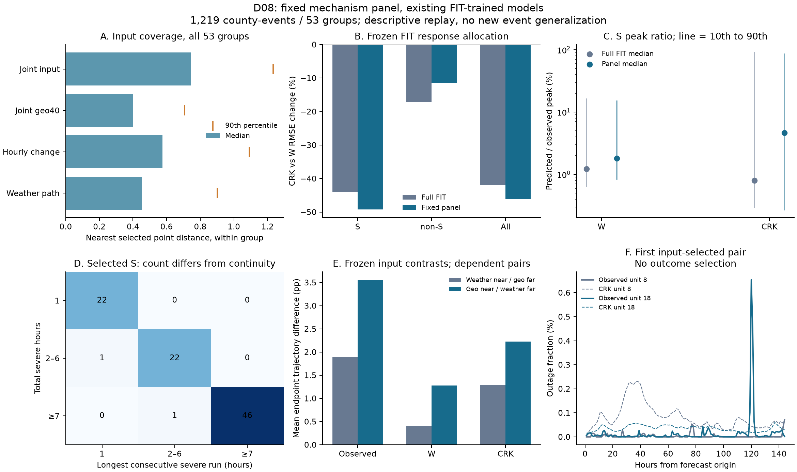

# D08：从输入固定小面板，核对真实响应差异与模型症状

日期：2026-09-29。本轮完成。原选择登记 `6a64a12`，存储格式修订及回放源码登记 `f819f67`。
依据：[D08范围](D08_INPUT_PANEL_SCOPE_20260929.md)、[纯IO修订](D08_IO_AMENDMENT_20260929.md)。
承接：[D07独立复核回应](D07_INDEPENDENT_REVIEW_RESPONSE_20260929_ZH.md)。

**实际数据中确实存在值得研究的条件响应差异，小面板也保留了收益集中和更新代价等症状。
但它没有完整代表原FIT，不能作为筛选新核的唯一门槛。** 名单已经固定，不因这个结果换县。
这一轮是原fold1 FIT的输入选择与冻结缓存审计，没有新前向、梯度、干预或训练。

机器证据：[紧凑结果](../results/v1/d08_evidence.json)、[完整汇总gzip](../results/v1/d08_panel_symptoms.json.gz)、
[输入独立复核](../results/v1/d08_input_independent_audit.json)、[评分独立复核](../results/v1/d08_final_audit.json)。
[284条对子标量明细](../results/v1/d08_pair_contrasts.csv)可供独立重算差异分布与重复端点；
不包含原始天气、停电或预测轨迹大数组。
以下新数字均来自这些文件；原D07的1.96% oracle及梯度尺度见独立复核回应及其回执。

## 1. 固定了什么，以及为什么这样抽样

从原fold1 FIT的6,350县事件、2,276县、61系统、53合并组出发，保留每组最多24单位。
大组16个确定性输入核心、8个均匀随机尾部，小组普查。实际1,219单位、819县，
全部61系统和53组保留；827核心/普查、392随机尾部。原折2…5标签的数量为348/336/271/264。

选择只读取完整216小时×12天气、geo40、身份和设计权，未读停电、mask、峰时、预测或收益。
尺度和地理填补仅用原FIT；没有低频替代、天气删选、地理配方或允许组合限制。
距离同时包含完整天气水平与全部相邻小时变化；geo40每维均保留。
这是覆盖工具，不能把“40维可用”写成覆盖了所有可能组合或证明了高阶机制。

| 天气类 | 面板单位 | 冻结后观察到的S单位 |
|---|---:|---:|
| 热带 | 255 | 35 |
| 冬季 | 192 | 18 |
| 大尺度风 | 228 | 25 |
| 对流 | 264 | 8 |
| 强降雨 | 280 | 6 |

名单、尺度、包含概率pi、输入对照及哈希先形成FROZEN封条，独立输入审计通过后才打开标签。
原geo中153个面板缺失条目保留原值并另存填补值，不把缺测悄悄变成真实零值。
公开名单：[roster](../results/v1/d08_panel_roster.json.gz)；覆盖：[input](../results/v1/d08_panel_input.json)。

原设计权的Kish有效单位支持，全FIT845.99、面板187.57；w/pi重加权后面板仅89.41。
最高单单位占重加权质量3.96%，最大事件组16.51%。小面板的覆盖和总体风险代表性须分开。
Kish反映权重集中程度，不是独立事件数；事件依赖仍按合并组处理。
HT可加总的固定预测SSE使用原完整FIT分母；RMSE平方根、分位数、样本计数及前10%集中度
均不能因此宣称无偏，更不能把训练风险变成泛化估计。

## 2. 从真实数据找到什么：相近输入仍对应异质响应

按输入固定的对照共有284条记录，实际260个唯一无序对子、331个参与单位：

- 同合并组“天气近、geo40远”：157条，137个唯一对子；55次没有合格伙伴。
- 不同合并组“geo40近、天气远”：127条，123个唯一对子；85次没有合格伙伴。

没有放宽阈值、重配对子或剔除不利结果。每个接受对子均有共同观测，最少86小时、中位144小时。
“近/远”分别为FIT输入距离分布的第10/75分位，天气近阈值1.2371、地理远阈值1.6675；
这表示相对输入支持，**不表示所有天气坐标都相同**。时钟按预测起点对齐，不必是同一绝对小时。

| 固定对照 | 绝对真峰差中位数 | 真峰差>=10个百分点的记录 | 真轨迹RMS差中位数 |
|---|---:|---:|---:|
| 天气近、地理远 | 1.286个百分点 | 21/157 | 0.189个百分点 |
| 地理近、天气远 | 2.325个百分点 | 29/127 | 0.505个百分点 |

第一类真轨迹RMS差的90%分位为2.729个百分点、最大54.242个百分点，均值1.895个百分点；
中位数远小于均值。第二类中位0.505、90%分位4.573、最大67.168个百分点。
因此整体平均会遮住普通响应与极端差异的并存，后续须追踪完整路径及局部输入条件。
这里的绝对峰差中位数是未加权记录的普通中位数，其他原汇总分位数遵循文件注明的权重插值规则。

这些对照给出了实际研究对象：相对接近的天气条件下，县的响应幅度和时序并不一致；
相近地理在不同天气过程下也有不同响应。但是基础设施、背景、剩余天气差异与测量误差
尚未被完全平衡，不能把差异直接归因于地理，更不能从中确认某个地理组合。
对子重复使用端点，不是157/127次独立因果试验。

CRK对两类差异的训练内再现优于W：逐对子对比误差RMSE的均值分别为
1.890→1.122个百分点、3.863→2.162个百分点。这个量衡量预测差异与观测差异的吻合，
不是两个单位的单独风险，也不是地理信息增量。原模型已训练这些FIT单位，不能推出事件迁移。

## 3. 小面板保留了哪些症状，又漏了什么

S仍定义为观测预测窗峰值>=10%；所有预测评分使用原观测mask、144小时。
完整FIT包含559个S，面板92个S，其中89个完整、3个不完整。

| 冻结回放指标 | 完整FIT | 面板原设计权 |
|---|---:|---:|
| CRK相对W的S RMSE下降 | 44.03% | 49.19% |
| S轨迹获益单位 | 409/559 | 65/92 |
| 获益单位覆盖S设计权 | 46.87% | 32.14% |
| 前约10% S单位占全部正收益 | 83.27%（56单位） | 82.97%（10单位） |
| S峰幅比中位数，W→CRK | 1.231%→0.800% | 1.809%→4.628% |
| non-S基线严重假峰，W→CRK | 1→4 | 0→0 |

49.19%是已经训练的FIT子集成绩，**不是新模型效果或兑现10%留出目标**。
面板收益同样集中，峰值仍弱，但原设计权中位数下降没有复现，4个CRK基线假峰均未入选。
w/pi重加权峰幅比中位数为W0.949%→CRK0.305%，恢复下降方向，却不能凭低有效支持宣称
面板精确代表总体。保留这个不一致，是固定输入选择的重要结果。

工作区症状保留：面板S真峰时，四模式平均deposit范数的设计权中位数0.99654，
相邻写入方向余弦中位数0.9999998；固定时钟的写入Jacobian范数中位数0.11561，
完整FIT为0.13756。近满幅和方向缓变存在，但不是全链天气到停电导数，也不说明有效秩一。
没有基线假峰的面板不能用于确认原假峰工作区已修好。

## 4. 连续过程与多段过程可以实际区分

完整FIT中，严重小时总数>=7的308个单位，只有295个最长连续严重段>=7。
另13个由较短观测段构成，其中10个144小时完整观测、3个不完整。缺测会打断段，
但这一区别并非完全由缺测产生。面板对应47与46，也有一个完整观测的分段病例。

面板小时总数分层：1小时22例，CRK RMSE轻微恶化0.214%；2–6小时23例下降37.33%；
>=7小时47例下降51.58%。按最长连续段分层则为23/23/46例，不能把两种分类混用。
这些属于FIT形态描述；原OOF的>=7小时仅改善1.06%，不能把训练内长过程拟合视为已迁移。

半峰幅段、峰时和相邻起涨/下降同时保留，缺测/窗口截断显式标记。它们帮助检验积累、
反复冲击和释放等假说，不能单凭形态确认这些潜在物理过程，更不能作为推理门输入。

## 5. 已有小参数干预的代价再次出现

只回放D07已登记的天气控制0.1%参数扰动，没有新增步长：

| 与同一CRK基线比较 | 完整FIT | 固定面板 |
|---|---:|---:|
| S RMSE变化 | −0.830% | −0.786% |
| non-S RMSE变化 | +0.649% | +0.894% |
| non-S严重假峰 | 4→12，新增8 | 0→1，新增1 |
| 最大逐小时预测变化 | 10.897个百分点 | 9.365个百分点 |
| non-S最大预测变化 | 4.898个百分点 | 3.313个百分点 |

小参数范数仍对应大函数变化。下一候选要约束数据支持区中的控制分辨率，并检验修正与
残差的方向/时间对齐；不能只增大出口、降低状态范数，或把梯度更小当作改进。
这一点与D07 oracle新增有效响应的要求相容：克制错误响应和恢复遗漏响应必须同时检查。

## 6. 对下一版设计与实验顺序的具体约束

核心研究链继续是天气过程→联合地理复杂调制→潜在冲击产生/叠加/累积→停电。
现有数据支持继续研究条件响应的幅度、时序和不同工作区，尚未证明稳定地理净收益。
地理保留全部40维和任意组合，不将观测到的S、真峰时或指定地理配方写入预测门。

本面板可以测试写入控制的数值性质、时间分辨率和函数变化预算；**不能成为候选的唯一风险门**，
尤其不能凭0个基线假峰挑选增大响应的设计。原6350FIT回放、完整原事件OUTER及全D五折
仍是不可被小面板代替的开发参照。不要为复现假峰或中位数重新选正式名单。

真正的未训练事件检验要另行固定小面板内层重训：原fold1模型见过全部FIT，原折2…5标签
现在只有组间身份意义。是否用这个部分代表的面板做基线重训，还须明确其用途和风险检查；
本轮没有自动启动八个内层训练或新核。若单独做已知失败casebook，也须标为回顾定位材料。

首个结构对照应单独改变写入控制的工作区/条件敏感度，保持宿主、Q/rho递推、出口及目标，
地理等函数重参数化单独检验。状态有界、增量敏感度和对齐收益分别评价，
不能把锚点改写称作等价变换，也不能同时叠加geoRMS和幅度变化后归因。
最终回到全D原五折的S下降10%目标、全D/假峰约束；单seed与多轮探索D不产生独立确认。

## 7. 复核、执行记录与交付

40项合成检查通过；22项独立真实输入检查通过；独立重算420个评分/分层行，
最大评分误差9.10e-12，原D07 FIT的S/RMSE/峰幅比分位数完全重现。
公开对子CSV的284行、全部26字段与冻结标量缓存逐值一致，独立复算两类峰差中位数与阈值计数通过。
原16源码、30训练产物、3份D07汇总以及预测缓存保持不变。

第一次读取在Fortran静态geo矩阵处失败，未生成名单或打开标签，空目录和日志保留。
纯IO修复只按地理坐标读取并取FIT字节，补4项检查后登记再运行；另一次CLI拒绝非hex提交别名
发生在输入打开前，日志也保留。正式输入选择和标签审计各成功一次，没有因结果重新抽样。
首版图因一个长标题贴近边界，保留初版并换行重绘，未改数据或分数。

所有本轮进程已退出；I18/I20监控保持暂停。没有读取C、原始年度标签或稿件，没有新训练。
完整汇总压缩前后哈希保留在紧凑证据与审计回执；忽略目录保存大数组，不公开目标/模型大数组。

图中B/C使用原设计权的FIT局部评分；E为依赖对子均值，不替代分布；F固定显示首个
输入选定的天气近/地理远对照，没有按停电或模型收益选择示例。
[PNG](../results/v1/fig_d08_fixed_panel.png)、[PDF](../results/v1/fig_d08_fixed_panel.pdf)。
源码：`d08_panel.py`、`d08_symptoms.py`、`audit_d08_final.py`、`export_d08_pairs.py`、
`plot_d08_panel.py`及两份D08检查文件。

GitHub：[研究目录](https://github.com/ShuaiWang-Castle/asymode-open-data/tree/research/geo-weather-process-20260924/experiments/geo_weather_20260924)。
结果同步到两个现有research分支，不推送main。原D07固定材料另有新名称的18文件重打包，
新包哈希 `411bf552f4e915616749bacb0ffe3a89e702f17219193677b50fa78bea2b8b7d`，没有冒充原ZIP身份。
